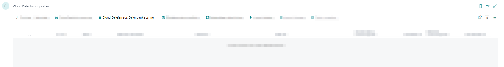
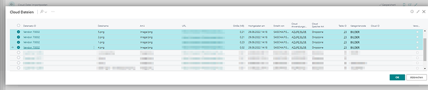
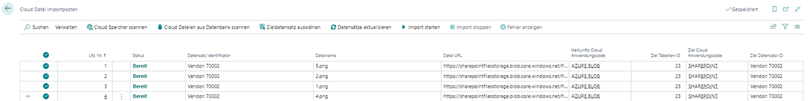

# Dateien in einen anderen Cloud-Speicher verschieben

BeyondCloudConnector ermöglicht es, Dateien zwischen zwei Cloudspeichern zu verschieben (beispielsweise um einen besser geeigneten Cloudspeicher zu verwenden oder Kosten zu sparen).  

>[!NOTE]  
>**System wird ausgelastet**  
Beachten Sie, dass das Verschieben von Dateien zwischen zwei Cloudspeichern viele Systemressourcen bindet. Das System kann bei einer großen Anzahl von Dateien ausgelastet werden, d.h. es kann zu Beeinträchtigungen des Betriebs kommen. Führen Sie diese Funktion nicht mit großen Datenmengen und möglichst außerhalb der Öffnungs- bzw. Geschäftszeiten aus.  

Gehen Sie wie folgt vor, um über BeyondCloudConnector Dateien zwischen zwei Cloudspeichern zu verschieben:  

1. Öffnen Sie Ihr Business Central.  
1. Rufen Sie aus dem Rollencenter die Suchfunktion auf (**ALT+Q**) 🔍.  
1. Suchen Sie nach der Seite **[Cloud Datei Importposten](https://businesscentral.dynamics.com/?page=70838585)** und klicken Sie auf das entsprechende Suchergebnis.  
1. Die Seite **Cloud Datei Importposten** wird angezeigt.  
1. Klicken Sie in der Menüleiste auf **Cloud-Dateien aus Datenbank scannen**.  
      
1. Das Fenster **Bearbeiten – Cloud Dateien scannen…** wird angezeigt.  
1. Geben Sie in dem Feld **Neuer Cloud-Anwendungscode** den Anwendungscode des Cloudspeichers an, in das Sie die Dateien verschieben möchten.  
1. Klicken Sie auf **OK**.  
1. Das Fenster **Cloud Dateien** wird angezeigt. In dieser Liste werden alle Dateien aus allen Cloudspeichern angezeigt, die über Business Central verknüpft sind.  
1. Wählen Sie die Dateien aus, die Sie in den neuen Cloudspeicher verschieben möchten.  
      
1. Klicken Sie auf **OK**. Die ausgewählten Dateien werden in der Liste **Cloud-Datei Importposten** angezeigt. Unter der Spalte **Herkunfts Cloud Anwendungscode** wird der aktuelle Cloudspeicherort (Anwendungscode) der Dateien angezeigt. Unter der Spalte **Ziel Cloud Anwendungscode** wird der neue Cloudspeicherort (Anwendungscode) der Dateien angezeigt.  
      
1. Markieren Sie die Dateien und klicken Sie in der Menüleiste auf **Import starten**.  
1. Die Dateien werden in den neuen Cloudspeicher verschoben.  

Sie haben die Dateien in einen anderen Cloudspeicher verschoben.  

Wenn Sie eine oder mehrere Dateien in einen anderen Datensatz (Dropzone) kopieren möchten, können Sie die Dateien über die entsprechende Dropzone hochladen oder im Batch über die Clouddatei-Importposten kopieren. Weitere Informationen zu diesem Thema erhalten Sie unter dem Kapitel [Dateien in eine anderen Datensatz kopieren](copy-files-to-different-record.md).  
