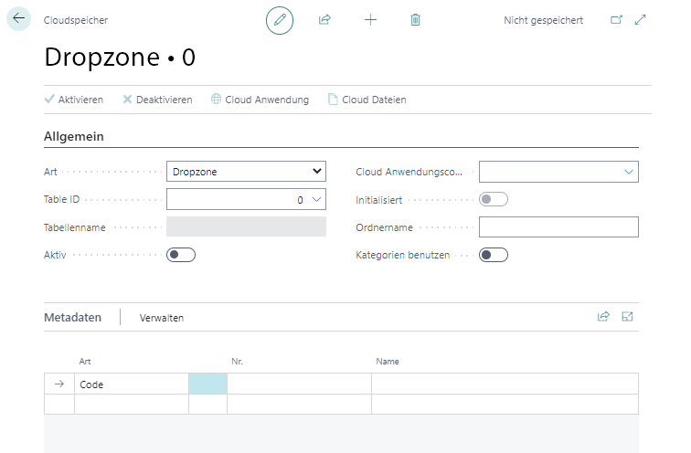

# Dropzone einrichten

In diesem Kapitel wird beschrieben, wie Sie eine Dropzone in Business Central einrichten. Die Dropzone ermöglicht es Ihnen, Dateien über Business Central in Ihren Cloudspeicher ([Sharepoint](set-up-for-sharepoint.md), [Azure Files](set-up-for-azure-files.md) oder [Azure Blob Storage](set-up-for-azure-blob-storage.md)) hochzuladen und auf diese Dateien zuzugreifen.  

In der nachfolgenden Beschreibung wird erläutert, wie Sie eine Dropzone für Artikel einrichten.  

1. Öffnen Sie Ihr Business Central.  
1. Rufen Sie aus dem Rollencenter die Suchfunktion auf (**ALT+Q**) 🔍.  
1. Suchen Sie nach **[Cloud Speicher](https://businesscentral.dynamics.com/?page=70838580)** und klicken Sie auf das entsprechende Suchergebnis.
Die Seite **Cloud Speicher** wird angezeigt.  
1. Um eine neue Dropzone einzurichten, klicken Sie in der Menüleiste auf **Neu**.  
1. Wählen Sie aus der Dropdownliste **Art** die Option **Dropzone** aus.  
      
1. Wählen Sie aus der Dropdownliste **Table ID** die Tabelle aus, für die Sie eine Dropzone hinzufügen möchten. Beachten Sie, dass die Dropzone nur für Tabellen hinzufügen können, die in dieser Dropdownliste hinterlegt sind. Um eine Dropzone für Artikel einzurichten, geben Sie in diesem Feld die ID **27** an.  
1. Nach Angabe der Tabellen-ID, wird das Feld **Tabellenname** automatisch vom System gefüllt.  
1. Geben Sie im Feld **Cloud Anwendungscode** die Cloud-Anwendung an, die Sie für die Speicherung der Daten verwenden möchten.  
1. Geben Sie im Feld **Ordername** eine Bezeichnung für die zu erstellenden Ordner an, die im Cloud-Speicherhierarchie erstellt werden, um die hochgeladenen Daten zu speichern. Standardmäßig wird dieses Feld mit der Bezeichnung für die Tabellen-ID vorbelegt.  
1. **<u>Optional</u>**: Aktivieren Sie den Schieberegler **Kategorien benutzen**, um Dateien in frei definierbare Kategorien (beispielsweise in Bilder, Videos, E-Mails und PDF-Dokumente) zu unterteilen. Die Kategorien können als Suchkriterium bei der Suche nach Dateien verwendet werden. Weitere Informationen zu Kategorien erhalten Sie unter dem Abschnitt [Kategorien für eine Dropzone einrichten](set-up-categories-for-dropzone.md).  
1. Unter dem Register **Metadaten** können Sie zusätzliche Informationen festlegen, die beim Hochladen von Dateien über die Dropzone in den Cloudspeicher gespeichert werden. Die Metadaten können bei der Suche nach Dateien in der Cloud (siehe Kapitel [Dateien suchen](../features/search-files.md)) als Suchkriterium definiert werden.  
1. Klicken Sie in der Menüleiste auf **Aktivieren**, um die Dropzone zu der Tabelle hinzuzufügen. Der Schieberegler **Aktiv** wird grau hinterlegt und zeigt an, dass diese Dropzone korrekt eingerichtet ist.  

Sie haben die Dropzone eingerichtet. Auf den eingestellten Tabellen wird im Infoboxbereich (ALT+F2) die Dropzone angezeigt.  
      

Weitere Informationen zu den Funktionen der Dropzone erhalten Sie unter den Kapiteln:  

+ [Dateien hochladen](../features/upload-files.md)  
+ [Dateien löschen](../features/delete-files.md)  
+ [Dateivorschau anzeigen](../features/preview-files.md)  
+ [PDF-Dateien kombinieren](../features/merge-pdf-files.md)  
+ [Dateien in eine Kategorie verschieben](../features/move-files-to-different-category.md)  

