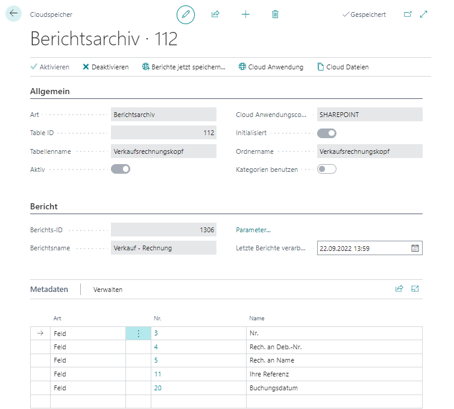

# Berichtsarchivierung einrichten

In diesem Kapitel wird beschrieben, wie Sie die automatische Berichtsarchivierung für Ihren Cloudspeicher einrichten. Sie können die Berichtsarchivierung so einrichten, dass Ihre in Business Central erzeugten Belege (beispielsweise Rechnungen, Bestellungen, Gutschriften usw.) automatisch in einen ihrer eingerichteten Cloudspeicher ([Sharepoint](set-up-for-sharepoint.md),[Azure Files](set-up-for-azure-files.md) oder [Azure Blob Storage](set-up-for-azure-blob-storage.md)) hochgeladen werden.  

Bei der Berichtsarchivierung können keine Kategorien verwendet werden.  

Um eine automatische Berichtsarchivierung einzurichten, gehen Sie wie folgt vor:  

1. Öffnen Sie Ihr Business Central.  
1. Rufen Sie aus dem Rollencenter die Suchfunktion auf (**ALT+Q**) 🔍.
1. Suchen Sie nach **[Cloud Speicher](https://businesscentral.dynamics.com/?page=70838580)** und klicken Sie auf das entsprechende Suchergebnis.
Die Seite **Cloud Speicher** wird angezeigt.  
1. Um eine neue Dropzone einzurichten, klicken Sie in der Menüleiste auf **Neu**.  
1. Wählen Sie aus der Dropdownliste **Art** die Option **Berichtsarchiv** aus.  
1. Die Karte **Cloudspeicher** wird um das Register **Bericht** erweitert.  
      
1. Wählen Sie aus der Dropdownliste **Table ID** die Tabelle aus, für die Sie eine Berichtsarchivierung hinzufügen möchten. Beachten Sie, dass die Berichtsarchivierung nur für Tabellen hinzufügen können, die in dieser Dropdownliste hinterlegt sind. Um beispielsweise eine Berichtsarchivierung für Verkaufsrechnungen einzurichten, geben Sie die ID **112** an.  
1. Nach Angabe der Tabellen-ID (**112**), wird das Feld **Tabellenname** automatisch vom System gefüllt (mit dem Wert **Verkaufsrechnungskopf**).  
1. Geben Sie im Feld **Cloud Anwendungscode** die Cloud-Anwendung an, die Sie für die Speicherung der Daten verwenden möchten.  
1. Geben Sie unter der Registerkarte **Bericht** im Feld **Berichts-ID** den Bericht an, den Sie automatisch archivieren möchten.  
1. Das Feld **Ordername** wird automatisch ergänzt. Standardmäßig wird dieses Feld mit der Bezeichnung für die Berichts-ID vorbelegt.  
1. Unter dem Register **Metadaten** können Sie zusätzliche Informationen festlegen, die beim Hochladen von Dateien über die Berichtsarchivierung in den Cloudspeicher gespeichert werden. Bei einer Verkaufsrechung können Sie beispielsweise die Feldinformationen der Felder **Nr.**, **Rech. an Deb.-Nr.**, **Rech. an Name**, **Ihre Referenz** und **Buchungsdatum** als Metadaten bei der Archivierung für die Datei mitspeichern. Die Metadaten können bei der Suche nach Dateien in der Cloud (siehe Kapitel [Dateien suchen](../features/search-files.md)) als Suchkriterium definiert werden. 
1. Klicken Sie in der Menüleiste auf **Aktivieren**, um die Berichtsarchivierung zu starten. Der Schieberegler **Aktiv** wird grau hinterlegt und zeigt an, dass dieses Berichtsarchiv korrekt eingerichtet ist.  
      

Sie haben das Berichtsarchiv eingerichtet. Alle den definierten Kriterien entsprechenden Berichte/Belege werden automatisch in die angegebene Cloudanwendung hochgeladen.  

