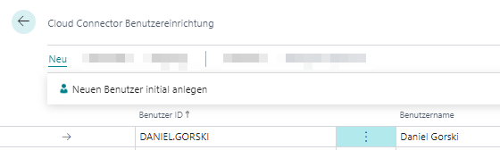
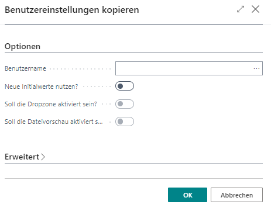

# Benutzer einrichten

In diesem Kapitel wird beschrieben, wie Sie [Benutzer hinzufügen](#create-new-user) und [Benutzerberechtigungen kopieren](#copy-user-permissions).  

>[!NOTE]  
>**Benutzerlizenzen und Lizenzmodelle**  
Beachten Sie, dass Sie alle neuen Benutzer lizensieren müssen, wenn Sie keine unbeschränkte Lizenz für Beyond CloudConnector erworben haben. Wenn Sie weitere Lizenzen benötigen oder auf ein anderes Lizenzmodell wechseln möchten, kontaktieren Sie uns unter 
<a href="mailto:info@beyondit.gmbh?cc=sascha.fischer@beyondit.gmbh&amp;subject=Lizenz für BeyondCloudConnector erwerben">info@beyondit.gbmh</a>.  

## Benutzer hinzufügen

In diesem Abschnitt wird beschrieben, wie Sie einem Benutzer die Berechtigung erteilen, um den  BeyondCloudConnector zu verwenden.  

Um einen Benutzer einzurichten, gehen Sie wie folgt vor:  

1. Öffnen Sie Ihr Business Central.  
1. Rufen Sie aus dem Rollencenter die Suchfunktion auf (**ALT+Q**) 🔍.
1. Suchen Sie nach **[Cloud Connector Benutzereinrichtung](https://businesscentral.dynamics.com/?page=70838596)** und klicken Sie auf das entsprechende Suchergebnis. Die Seite **Cloud Connector Benutzereinrichtung** wird angezeigt.  
1. In der Liste werden alle eingerichteten Benutzer und die zugewiesenen Berechtigungen angezeigt.  
1. Klicken Sie in der Menüleiste auf **Neu** > **Neuen Benutzer initial anlegen**.  
      
1. Die Seite **Benutzersuche** wird angezeigt. In dieser Liste werden alle Benutzer angezeigt, die in Ihrem Business Central eingerichtet sind.  
1. Wählen Sie aus der Tabelle den Benutzer aus, den Sie in die Liste der Benutzer von BeyondCloudConnector hinzufügen möchten.  
1. Klicken Sie auf **OK**, um das Fenster zu schließen und den Benutzer zur Seite **Cloud Connector Benutzereinrichtung** hinzuzufügen.  
1. Scrollen Sie in der Liste zu dem hinzugefügten Benutzer.  
1. Über die Kontrollkästchen in den Spalten **Dropzone aktiviert** und **Dateivorschau aktiviert** können Sie die Zugriffsberechtigungen des Benutzers für die Anzeige von Dropzones bzw. die Dateivorschau für Cloud-Dateien einstellen. Standardmäßig wird bei neuen Benutzern die Zugriffberechtigung auf die Dropzone aktiviert.  

Sie haben einen Benutzer zur Liste **Cloud Connector Einrichtung** hinzugefügt.  

## Benutzerberechtigungen kopieren

In diesem Abschnitt wird beschrieben, wie Sie die Benutzerberechtigungen eines bereits vorhandenen Benutzers auf einen neu hinzugefügten Benutzer kopieren können. Sie erteilen dem neu hinzugefügten Benutzer damit dieselben Berechtigungen wie dem bereits vorhandenem Benutzer.  

Gehen Sie wie folgt vor, wenn Sie einem neu hinzugefügten Benutzer dieselben Berechtigungen wie einem bereits vorhandenem Benutzer erteilen möchten:  

1. Öffnen Sie Ihr Business Central.  
1. Rufen Sie aus dem Rollencenter die Suchfunktion auf (**ALT+Q**) 🔍.
1. Suchen Sie nach **[Cloud Connector Benutzereinrichtung](https://businesscentral.dynamics.com/?page=70838596)** und klicken Sie auf das entsprechende Suchergebnis. Die Seite **Cloud Connector Benutzereinrichtung** wird angezeigt.  
1. In der Liste werden alle eingerichteten Benutzer und die zugewiesenen Berechtigungen angezeigt.  
1. Wählen Sie einen Benutzer aus der Liste aus und markieren Sie alle Berechtigungen, die Sie für einen neu hinzugefügten Benutzer übertragen möchten.  
1. Klicken Sie in der Menüleiste auf **Vorgang** > **Benutzereinstellungen zu anderem Nutzer kopieren**.  
1. Das Fenster **Benutzereinstellungen kopieren** wird angezeigt.  
      
1. Wählen Sie aus dem Dropdownmenü **Benutzername** den Benutzer aus. Beachten Sie, dass Sie nur die Berechtigungen auf den neu hinzugefügten Benutzer übertragen, die zuvor aus der Liste ausgewählt wurden.  
1. Klicken Sie auf **OK**, um die ausgewählten Berechtigungen für den neu hinzugefügten Benutzer zu kopieren.  

>[!NOTE]  
>**Alle Berechtigungen des Benutzers ändern**  
Sie können im Fenster **Benutzereinstellungen kopieren** über die Option **Neue Initialwerte nutzen?** alle Berechtigungen des neu hinzugefügten Benutzer ändern. Aktivieren Sie die Kontrollkästchen für **Neue Initialwerte nutzen?**, **Soll die Dropzone aktiviert sein?** und **Soll die Dateivorschau aktiviert sein?**, um die Dropzone für alle eingestellten Tabellen einzublenden und innerhalb der Dropzone die Dateivorschau für den Benutzer zu ermöglichen.  

