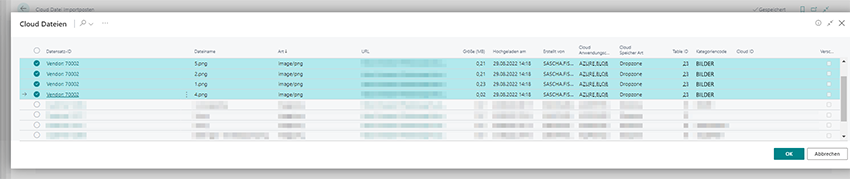
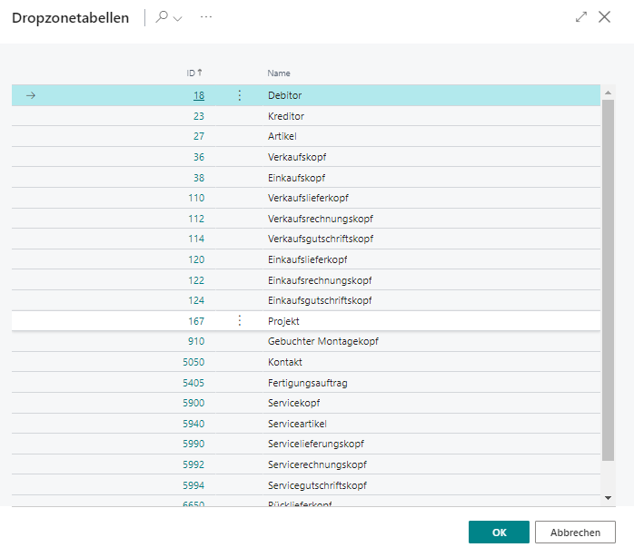

# Dateien in einen anderen Datensatz kopieren

Wenn Sie mehrere Dateien in Dropzones in einen anderen Datensatz (Dropzone) verschieben möchten, können Sie die Dateien manuell hochladen oder die Clouddatei-Importposten verwenden. Sie kopieren dabei die Dateien in den neuen Datensatz, am Kopierort bleiben alle Dateien erhalten.  

>[!NOTE]  
>**System wird ausgelastet**  
Beachten Sie, dass das Kopieren von Dateien zwischen zwei Datensätzen viele Systemressourcen bindet. Das System kann bei einer großen Anzahl von Dateien ausgelastet werden, d.h. es kann zu Beeinträchtigungen des Betriebs kommen. Führen Sie diese Funktion nicht mit großen Datenmengen und möglichst außerhalb der Öffnungs- bzw. Geschäftszeiten aus.  

Gehen Sie wie folgt vor, um über BeyondCloudConnector Dateien in einen anderen Datensatz zu kopieren:  

1. Öffnen Sie Ihr Business Central.  
1. Rufen Sie aus dem Rollencenter die Suchfunktion auf (**ALT+Q**) 🔍.  
1. Suchen Sie nach der Seite **[Cloud Datei Importposten](https://businesscentral.dynamics.com/?page=70838585)** und klicken Sie auf das entsprechende Suchergebnis.  
1. Die Seite **Cloud Datei Importposten** wird angezeigt.  
1. Klicken Sie in der Menüleiste auf **Cloud-Dateien aus Datenbank scannen**.  
      
1. Das Fenster **Bearbeiten – Cloud Dateien scannen…** wird angezeigt.  
1. Geben Sie in dem Feld **Neuer Cloud-Anwendungscode** den Anwendungscode des Cloudspeichers an, in das Sie die Dateien kopieren möchten.   
1. Klicken Sie auf **OK**.  
1. Das Fenster **Cloud Dateien** wird angezeigt. In dieser Liste werden alle Dateien aus allen Cloudspeichern angezeigt, die über Business Central verknüpft sind.  
1. Wählen Sie die Dateien aus, die Sie in einen anderen Datensatz kopieren möchten.  
      
1. Klicken Sie auf **OK**. Die ausgewählten Dateien werden in der Liste **Cloud-Datei Importposten** angezeigt. 
1. Markieren Sie die Dateien und klicken Sie in der Menüleiste auf **Zieldatensatz auswählen**.  
1. Das Fenster **Dropzonetabellen** wird angezeigt.  
      
1. Wählen Sie die Dropzonetabelle aus, in die die ausgewählten Dateien verschoben werden sollen.  
1. Klicken Sie auf **OK**.  
1. Die entsprechende Tabelle mit den Datensätzen wird angezeigt. Wählen Sie den entsprechenden Datensatz aus.  
1. Klicken Sie auf **OK**, um die Einstellungen für den Kopiervorgang der Dateien zu speichern.  
1. Die gespeicherten Kopiereinstellungen werden auf der Seite **Cloud Datei Importposten** angezeigt.  
1. Markieren Sie alle zu kopierenden Dateien in der Liste.  
1. Klicken Sie in der Menüleiste auf **Import starten**. Die Dateien werden in den unter der Spalte **Ziel Datensatz-ID** angegebenen Datensatz kopiert.  
1. Klicken Sie auf **Datensätze aktualisieren** und prüfen Sie, ob alle Dateien kopiert wurden.  

Sie haben eine oder mehrere Dateien in einen neuen Datensatz kopiert. Sie können in der dem Datensatz zugehörigen Dropzone die Datei anschauen und bearbeiten. Weitere Informationen zur Anzeige und Bearbeitung von Dateien in der Dropzone erhalten Sie unter dem Kapitel [Dateivorschau anzeigen](preview-files.md).  