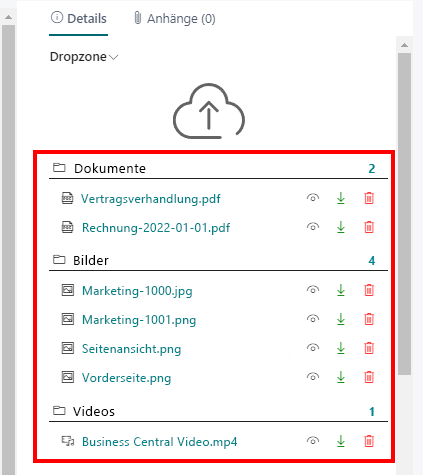
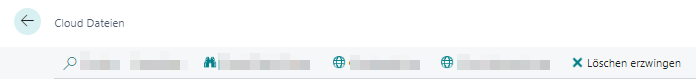

# Dateien löschen

In diesem Kapitel wird beschrieben, wie Sie Dateien im Cloudspeicher über Business Central löschen.  

>[!NOTE]  
>**Löschen von Dateien**  
Löschen Sie Dateien nur, wenn Sie sich absolut sicher sind, dass diese nicht mehr benötigt werden. Löschen Sie Dateien direkt im Cloudspeicher hat dies zur Folge, dass die Verknüpfung zur Datei weiterhin in Business Central angezeigt wird, aber die verknüpfte Datei nicht mehr auffindbar ist. Administratoren können nicht mehr verknüpfte Dateien von den Datensätzen löschen. Gehen Sie zum Löschen von Dateien und Dateiverknüpfungen ausschließlich wie in diesem Kapitel beschrieben vor. Weitere Informationen zum Löschen von Dateiverknüpfungen erhalten Sie unter dem Abschnitt [Verknüpfungen zu Dateien in der Cloud löschen](#delete-connection-to-files-saved-in-the-cloud).  

1. Wenn der Infoboxbereich mit der Dropzone noch nicht angezeigt wird, blenden Sie diesen mit der Tastaturkombination **ALT+F2** ein.  
      
1. Klicken Sie in der Dropzone auf das Papierkorb-Symbol.  
1. Sie werden gefragt, ob Sie die Datei wirklich löschen möchten. Bestätigen Sie die Meldung mit **Ja**.  

Sie haben die Datei im Cloudspeicher sowie die spezifische Dateiverknüpfung zwischen Business Central und dem angebundenen Cloudspeicher gelöscht. Das Wiederherstellen der Datei im Cloudspeicher stellt dabei nicht die Verknüpfung zu Business Central her. Sie müssen die entsprechende Datei über Business Central wieder erneut hochladen.  

## Verknüpfungen zu Dateien in der Cloud löschen

In diesem Abschnitt wird beschrieben, wie Sie eine Dateiverknüpfung löschen. 
Sie müssen die Dateiverknüpfung löschen, wenn die in Business Central (in der Dropzone) anzuzeigende Datei im angebundenen Cloudspeicher gelöscht wurde.  

Um die Dateiverknüpfung zwischen Business Central und dem Cloudspeicher zu löschen, gehen Sie wie folgt vor:  

1. Notieren Sie sich den Namen der ungültigen Datei sowie die dazugehörigen Metadaten.  
1. Rufen Sie aus dem Rollencenter die Suchfunktion auf (**ALT+Q**) 🔍.
1. Suchen Sie nach **[Cloud Dateien](https://businesscentral.dynamics.com/?page=70838576)** und klicken Sie auf das entsprechende Suchergebnis.
Die Seite **Cloud Dateien** wird angezeigt.  
1. Blenden Sie den Filterbereich ein (**UMSCHALT+F3**).  
1. Definieren Sie anhand des Dateinamens (ggf. auch anhand der Metadaten) einen Filter für die Datei.  
1. Wählen Sie die Datei aus, dessen Dateiverknüpfung Sie löschen möchten.  
1. Klicken Sie in der Menüleiste auf **Löschen erzwingen**.  
      

Sie haben die Dateiverknüpfung erfolgreich gelöscht.  

>[!NOTE]  
>**Verknüpfung gelöscht**  
Beachten Sie, dass die Verknüpfung in Business Central zur Datei im Cloudspeicher gelöscht ist. Wenn Sie die Datei im Cloudspeicher wiederherstellen, wird diese **nicht** in Business Central angezeigt. Um die Verknüpfung zur Datei wiederherzustellen, müssen Sie die Datei für den entsprechenden Datensatz über die Dropzone hochladen. Weitere Informationen dazu erhalten Sie unter dem Kapitel [Dateien hochladen](upload-files.md).  

