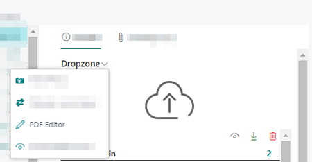
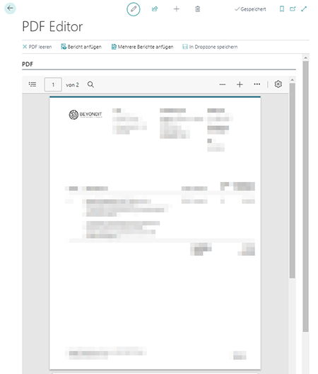

# PDF-Dateien zusammenführen

BeyondCloudConnector ermöglicht es Ihnen zwei oder mehrere PDF-Dateien zu einer Datei zusammenführen.  

Um zwei oder mehrere PDF-Dateien zu kombininieren, gehen Sie wie folgt vor:  

1. Blenden Sie auf der entsprechenden Karte den Infoboxbereich (**ALT+F2**) ein.  
1. Der Infoboxbereich mit der Dropzone wird angezeigt.  
1. Um die PDF-Datei auszuwählen, klicken Sie in der Dropzone auf das Symbol vor den Namen der PDF-Datei.  
1. Vor der ausgewählten Datei wird ein Hakensymbol angezeigt.  
1. Um den PDF-Editor zum Kombinieren von PDF-Dateien zu öffnen, klicken Sie in der Dropzone auf das Dropdownmenü unter der Überschrift **Dropzone**.  
1. Klicken Sie auf **PDF-Editor**.  
      
1. Der PDF-Editor wird angezeigt.  
      
1. Um die PDF-Datei mit einem PDF-Bericht zusammenzuführen, klicken Sie auf **Bericht anfügen**. Über die Aktion **Mehrere Berichte anfügen** können Sie mehr als eine PDF-Datei anfügen.  
1. Das Fenster **Berichtsauswahl** wird geöffnet.  
1. Wählen Sie den Bericht bzw. die Berichte aus, die Sie mit der in der Dropzone ausgewählten PDF-Datei zusammenführen möchten.  
1. Klicken Sie auf **OK**.  
1. Ein neues Fenster wird angezeigt. Definieren Sie die Berichtsparameter.  
1. Um den Bericht oder die Berichte zusammenzuführen, klicken Sie auf **OK**.  
1. Um die zusammengeführte PDF-Datei zu speichern, klicken Sie in der Menüleiste der Seite **PDF-Editor** auf **In Dropzone speichern**. Die Funktion **PDF leeren** ermöglicht es Ihnen, den Inhalt der PDF-Datei zu löschen.  
1. Geben Sie den Dateinamen für die neu erstellte PDF-Datei an.  
1. Klicken Sie auf **OK**. Wenn Sie Kategorien für die Dropzone eingerichtet haben, werden Sie dazu aufgefordert, eine Kategorie für die Datei anzugeben.  
1. Wählen Sie die Kategorie aus und bestätigen Sie das Dialogfenster mit **OK**.  

Die Datei wurde der Dropzone hinzugefügt. Sie können diese jetzt in der Dateivorschau betrachten oder über die zusätzlichen Funktionen für PDF-Datei in der Dateivorschau bearbeiten. Weitere Informationen zu der Dateivorschau und den verschiedenen Bearbeitungsoptionen (je nach Dteiformat) erhalten Sie unter dem Kapitel [Dateivorschau anzeigen](preview-files.md).  

