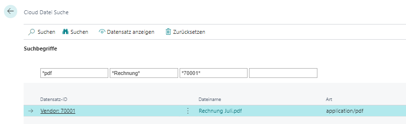

# Dateien suchen

In diesem Kapitel wird beschrieben, wie Sie Dateien in Business Central über BeyondCloudConnector in den angebundenen Cloudspeichern suchen können. An den Dateien hinterlegte Metadaten und Kategorien können dabei als Suchkriterien definiert werden.  

Gehen Sie wie folgt vor, um eine Datei in den Cloudspeichern über BeyondCloudConnector zu suchen:  

1. Öffnen Sie Ihr Business Central.  
1. Rufen Sie aus dem Rollencenter die Suchfunktion auf (**ALT+Q**) 🔍.  
1. Suchen Sie nach der Seite **[Cloud Datei Suche](https://businesscentral.dynamics.com/?page=70838588)** und klicken Sie auf das entsprechende Suchergebnis.  
1. Die Seite **Cloud Datei Suche** wird angezeigt.  
      
1. Geben Sie in das Eingabefeld ein Suchkriterium ein.  
1. Klicken Sie in der Menüleiste auf **Suchen**.  
1. Grenzen Sie bei Bedarf die Suchergebnisse ein, indem Sie weitere Suchkriterien definieren. Sie können auch Metadaten und Kategorien als Suchkriterien verwenden.  
      
1. Klicken Sie in der Menüleiste auf **Datensatz anzeigen**, um direkt auf den Datensatz zu navigieren.  
1. Die gesuchte Datei können Sie im Infoboxbereich (**ALT+F2**) in der Dropzone öffnen. Klicken sie dazu auf das Augensmybol neben dem Dateinamen.  

Sie haben Ihre Datei gefunden. Sollte sich die Datei über die Dropzone nicht aufrufen lassen, kann dies daran liegen, dass die Datei im Cloudspeicher gelöscht wurde, aber die Verknüpfung über Business Central noch hinterlegt ist. Weitere Informationen dazu erhalten Sie unter dem Kapitel [Dateien löschen](delete-files.md).  
