# Sharepoint als Cloud-Speicher einrichten

In diesem Kapitel wird beschrieben, wie Sie Ihr Business Central (mithilfe von BEYOND CloudConnector) mit Sharepoint verbinden.  
Die Anbindung von Sharepoint ermöglicht Ihnen den direkten Zugriff und die Bearbeitung von in der Cloud gespeicherten Dateien, ohne Business Central verlassen zu müssen.  

>[!NOTE]  
>**Berechtigungen in Microsoft Azure erforderlich**  
Für die nachfolgenden Beschreibungen sind Administratorberechtigungen in Microsoft Azure erforderlich. Für die Einrichtung der Verbindung müssen dazu berechtigt sein, Apps zu registrieren, API-Berechtigungen hinzuzufügen und einen geheimen Schlüssel zu erstellen. Wenn Sie Hilfe bei der Einrichtung benötigen oder diesbezüglich Fragen haben, können Sie uns gern unter 
<a href="mailto:info@beyondit.gmbh?cc=sascha.fischer@beyondit.gmbh&amp;subject=Sharepoint als Cloud-Speicher einrichten">info@beyondit.gbmh</a> kontaktieren.  

Führen Sie die nachfolgenden Schritte durch, um Sharepoint in Business Central anzubinden:  

+ [Anwendung in Microsoft Azure registrieren](#register-app-in-azure)
+ [API-Berechtigungen hinzufügen](#grant-api-authorizations)
+ [Zugriffsdaten vorbereiten](#prepare-access-data)
  + [Anwendungs-ID (Client) kopieren](#copy-client-id)
  + [Geheimen Schlüssel erzeugen und kopieren](#create-and-copy-secret)
  + [Autorisierungs-URL kopieren](#copy-authorization-url)
  + [Weiterleitungs-URL erstellen und kopieren](#create-and-copy-redirect-url)
  + [Zugriffstoken-URL kopieren](#copy-access-token-url)
+ [CloudConnector mit Sharepoint in Business Central anbinden](#connect-cloudconnector-in-business-central)

## Anwendung in Microsoft Azure registrieren

In diesem Abschnitt wird beschrieben, wie Sie die Anwendung (Beyond CloudConnector) in Microsoft Azure registrieren.  
Gehen Sie dazu wie folgt vor:

1. Öffnen Sie die Webseite [http://www.portal.azure.com/](http://www.portal.azure.com/) und melden Sie sich an.  
1. Klicken Sie in der Menüleiste von Microsoft Azure auf den Menüpunkt **App-Registrierungen**.  
    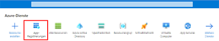  
1. Die Seite **App-Registrierungen** wird angezeigt. Klicken Sie in der Menüleiste auf **Neue Registrierung**.  
    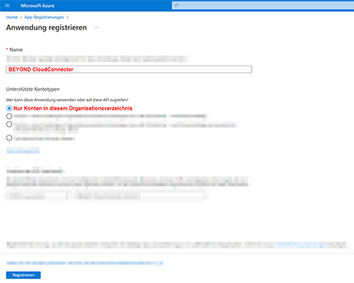  
1. Geben Sie unter **Name** eine passende Bezeichnung für die neue Anwendung ein. Wir empfehlen den Namen **BEYOND CloudConnector** zu verwenden.  
1. Unter **Unterstützte Kontotypen** wählen Sie die Option **Nur Konten in diesem Organisationsverzeichnis** aus.  
1. Um die Registrierung der Anwendung abzuschließen, klicken Sie auf **Registrieren**.  

Sie haben eine neue Anwendung in Microsoft Azure registriert. Dieser registrierten Anwendung (**BEYOND CloudConnector**) müssen Sie für die Verbindung zu Business Central, Microsoft Graph und Sharepoint die entsprechenden API-Berechtigungen hinzufügen.  

## API-Berechtigungen hinzufügen

In diesem Abschnitt wird beschrieben, wie Sie die API-Berechtigungen hinzufügen, die für den Datenaustausch (Read, Write und Manage) erforderlich sind. Sie müssen Berechtigungen für drei Programmschnittstellen (APIs) konfigurieren. Die verwendeten Schnittstellen sind Sharepoint, Dynamics 365 Business Central und Microsoft Graph.  

Um die API-Berechtigungen hinzuzufügen, gehen Sie wie folgt vor:  

1. Wenn Sie die Webseite für Microsoft Azure noch nicht geöffnet haben, klicken Sie auf den nachfolgenden Link und melden Sie sich an: [http://www.portal.azure.com/](http://www.portal.azure.com/).  
1. Klicken Sie in der Menüleiste von Microsoft Azure auf den Menüpunkt **App-Registrierungen**.  
      
1. Die Seite **App-Registrierungen** wird angezeigt.  
1. Klicken Sie in der angezeigten Tabelle **App-Registrierungen** auf die Anwendung, die Sie im Abschnitt [Anwendung in Microsoft Azure registrieren](#register-app-in-azure) erstellt haben.  
    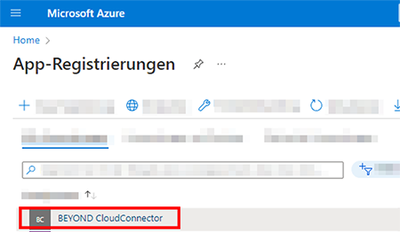  
1. Die entsprechende Seite für die App-Registrierung wird angezeigt.  
1. Um die Berechtigungen für die registrierte App anzuzeigen, klicken Sie im Menü auf **API-Berechtigungen**.  
    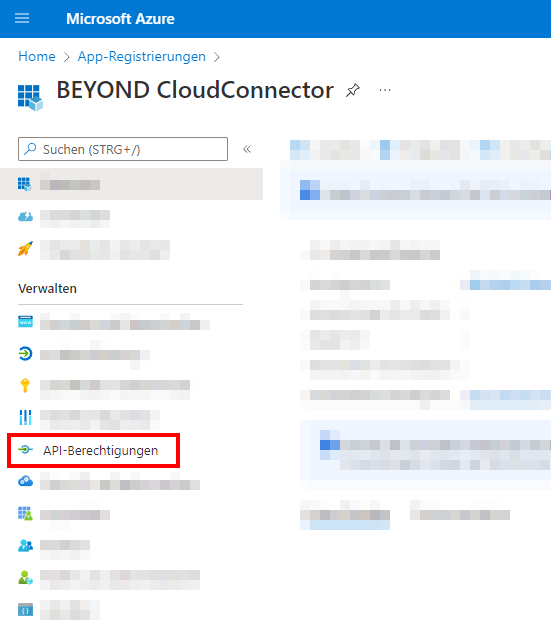  
1. Um die Berechtigung für **Dynamics 365 Business Central** hinzuzufügen, klicken Sie unter dem Bereich **Konfigurierte Berechtigungen** auf die Option **Berechtigung hinzufügen**.  
      
1. Das Fenster **API-Berechtigungen anfordern** wird angezeigt.  
    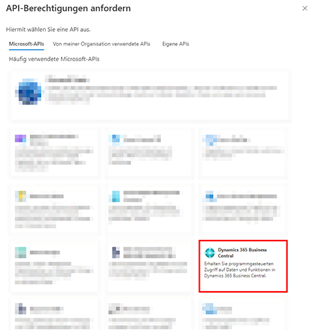  
1. Klicken Sie auf die API **Dynamics 365 Business Central**.  
1. Wählen Sie für die Berechtigungsart **Delegierte Berechtigungen** aus.  
1. Aktivieren Sie das Kontrollkästchen für die Berechtigung **Financials.ReadWrite.All**.  
    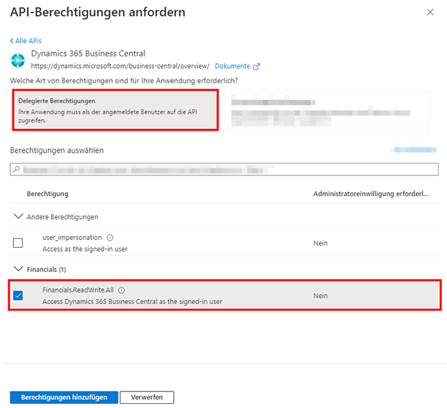  
1. Klicken Sie auf **Berechtigungen hinzufügen**.  
1. Sie haben die Berechtigung für Dynamics 365 Business Central erteilt. Diese wird unter dem Bereich **Konfigurierte Berechtigungen** in Ihrer App-Registrierung angezeigt.  
1. Um die weiteren erforderlichen Berechtigungen (**Sharepoint**) hinzuzufügen, klicken Sie im Bereich **Konfigurierte Berechtigungen** auf **Berechtigung hinzufügen**.  
    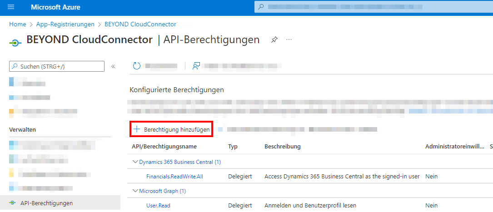  
1. Klicken Sie auf die API **Sharepoint**.  
    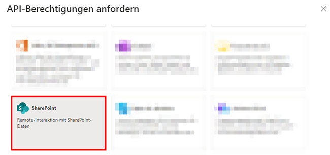  
1. Wählen Sie für die Berechtigungsart **Delegierte Berechtigungen** aus.  
1. Aktivieren Sie das Kontrollkästchen für die Berechtigung **AllSites.Manage**.  
    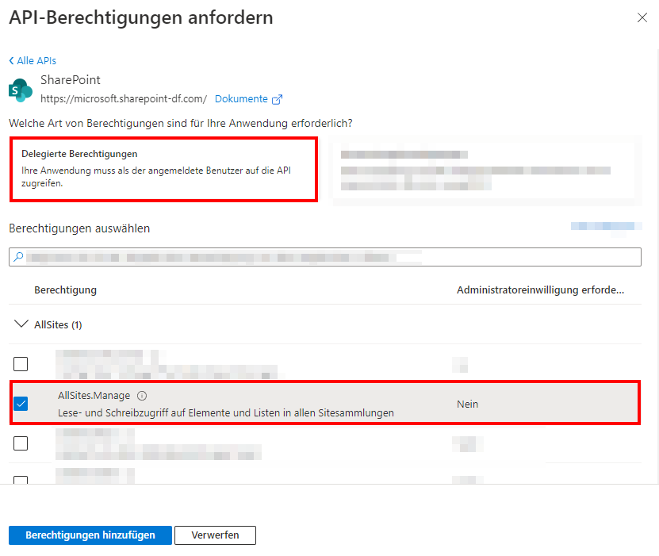  
1. Klicken Sie auf **Berechtigungen hinzufügen**.  
1. Sie haben die Berechtigung für Sharepoint erteilt. Die Berechtigungen für Dynamics 365 Business Central und Sharepoint werden unter dem Bereich **Konfigurierte Berechtigungen** in Ihrer App-Registrierung angezeigt.  
1. Um die weiteren erforderlichen Berechtigungen (**Microsoft Graph**) hinzuzufügen, klicken Sie im Bereich **Konfigurierte Berechtigungen** auf **Berechtigung hinzufügen**.  
    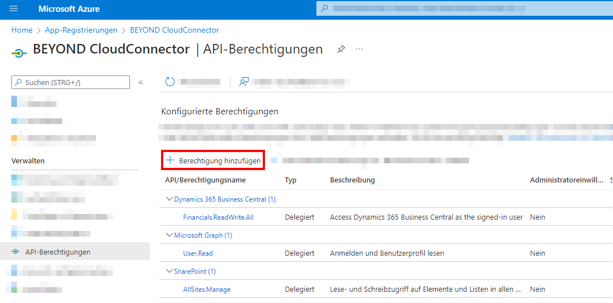  
1. Klicken Sie auf die API **Microsoft Graph**.  
    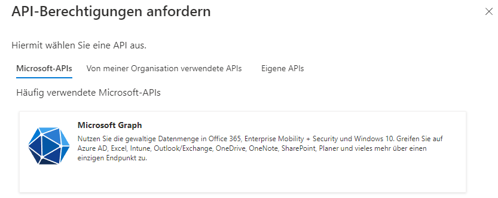  
1. Wählen Sie für die Berechtigungsart **Delegierte Berechtigungen** aus.  
1. Aktivieren Sie unter dem Bereich **Files** das Kontrollkästchen für die Berechtigung **Files.ReadWrite.All**.  
    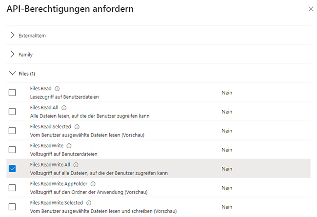  
1. Zusätzlich zur Berechtigung **Files.ReadWrite.All**, scrollen Sie zur Berechtigung **Sites** und aktivieren Sie das Kontrollkästchen für die Berechtigung **Sites.Read.All**.  
    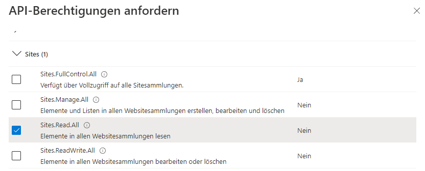  
1. Klicken Sie auf **Berechtigungen hinzufügen**.  
1. Sie haben die Berechtigung für Microsoft Graph erteilt. Die Berechtigungen für Dynamics 365 Business Central, Sharepoint und Microsoft Graph werden unter dem Bereich **Konfigurierte Berechtigungen** in Ihrer App-Registrierung angezeigt.  
    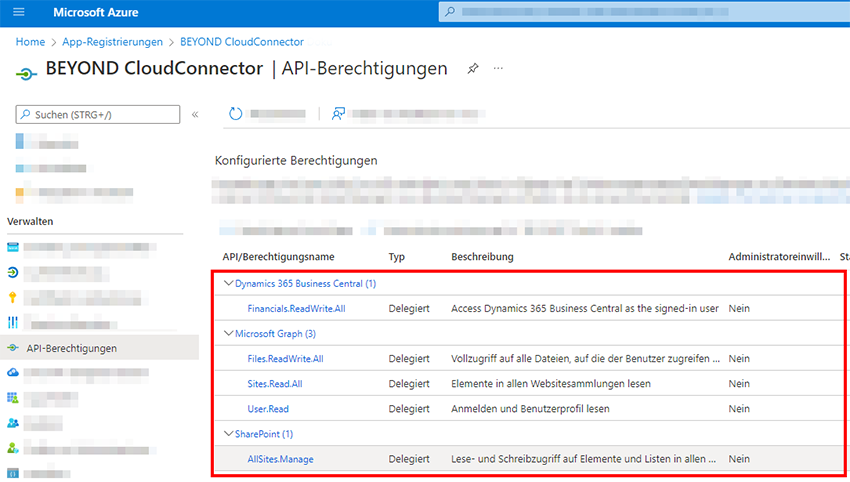  
Sie haben alle erforderlichen Berechtigungen zur Anbindung von Sharepoint über BEYOND CloudConnector hinzugefügt.

|**Dynamics 365  Business Central**|**Microsoft  Graph**|**Sharepoint**|
|:--|:--|:--|
|• Financials.ReadWrite.All|• Files.ReadWrite.All|• AllSites.Manage|
||• Sites.Read.All|
||• User.Read|

## Zugriffsdaten vorbereiten

Um Ihnen die Einrichtung zu erleichtern, haben wir eine PDF-Datei für Sie vorbereitet. In der PDF-Datei werden Informationen aus Microsoft Azure (z.B. Anwendungs-ID, Zugriffstoken usw.) zwischengespeichert, die Sie später für die Einrichtung in Business Central benötigen.  

Bitte laden Sie die Datei unter dem nachfolgenden Link herunter:  
<a href="http://docs.beyond365.de/de-DE/cloudconnector/assets/de_DE-CloudConnectorSharepointSetup.pdf" download>
  <button>Download</button>
</a>
<a href="http://docs.beyond365.de/de-DE/cloudconnector/assets/de_DE-CloudConnectorSharepointSetup.pdf">PDF-Datei herunterladen</a>

Öffnen Sie die PDF-Datei nach dem Download und fahren Sie mit den nachfolgenden Abschnitten fort:  

+ [Anwendungs-ID (Client) kopieren](#copy-client-id)
+ [Geheimen Schlüssel erzeugen und kopieren](#create-and-copy-secret)
+ [Autorisierungs-URL kopieren](#copy-authorization-url)
+ [Weiterleitungs-URL erstellen und kopieren](#create-and-copy-redirect-url)
+ [Zugriffstoken-URL kopieren](#copy-access-token-url)

### Anwendungs-ID (Client) kopieren

In diesem Unterabschnitt wird beschrieben, woher Sie die Information **Client-ID** für die Einrichtung von BEYOND CloudConnector in Business Central erhalten.  

1. Öffnen Sie die Webseite für Microsoft Azure [http://www.portal.azure.com/](http://www.portal.azure.com/) und melden Sie sich an.  
1. Klicken Sie in der Menüleiste von Microsoft Azure auf den Menüpunkt **App-Registrierungen**.  
      
1. Die Seite **App-Registrierungen** wird angezeigt.  
1. Klicken Sie in der angezeigten Tabelle **App-Registrierungen** auf die Anwendung, die Sie im Abschnitt [Anwendung in Microsoft Azure registrieren](#register-app-in-azure) erstellt haben.  
1. Klicken Sie in der Menüleiste auf **Übersicht**.  
1. Bewegen Sie den Mauszeiger auf den Wert **Anwendungs-ID (Client)**. Es wird ein Symbol eingeblendet, dass es Ihnen ermöglicht, den Wert in den Zwischerspeicher zu kopieren.  
    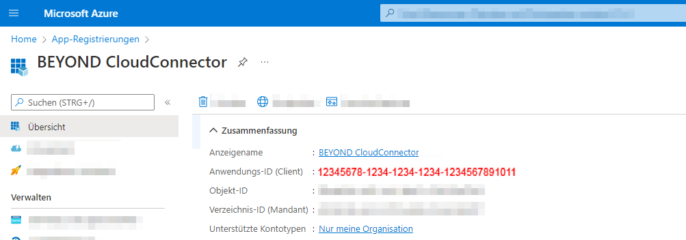  
1. Fügen Sie den Wert in der PDF-Datei unter dem Feld **Client-ID** ein.  

### Geheimen Schlüssel erzeugen und kopieren

In diesem Unterabschnitt wird beschrieben, wie Sie einen neuen geheimen Schlüssel in Ihrem Microsoft Azure erzeugen. Der geheime Schlüssel (auch **Client Secret** genannt) ist erforderlich, um die Verbindung zu Sharepoint abzusichern und sich zu authentifizieren.  

Um einen geheimen Schlüssel zu erzeugen, gehen Sie wie folgt vor:  

1. Wenn Sie die Webseite für Microsoft Azure noch nicht geöffnet haben, klicken Sie auf den nachfolgenden Link und melden Sie sich an: [http://www.portal.azure.com/](http://www.portal.azure.com/).  
1. Klicken Sie in der Menüleiste von Microsoft Azure auf den Menüpunkt **Zertifikate & Geheimnisse**.  
    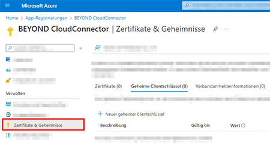  
1. Wählen Sie aus der Menüleiste **Neue geheimer Schlüssel** aus.  
1. Geben Sie unter dem Feld **Beschreibung** einen Namen für den Schlüssel ein (beispielsweise **BEYOND CloudConnector**).  
1. Definieren Sie unter dem Feld **Gültig bis** die Gültigkeitsdauer des Schlüssels. Wir empfehlen, die Gültigkeitsdauer mit 12 Monate anzugeben. Beachten Sie, dass nach Ablauf dieses Zeitraums/Datums ein neuer Schlüssel erzeugt werden muss.  
    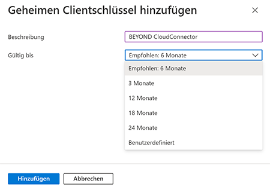  
1. Um den Schlüssel zu erstellen, klicken Sie auf **Hinzufügen**.  
1. Der neue geheime Schlüssel wird zur Seite **Zertifikate & Geheimnisse** hinzugefügt.  
    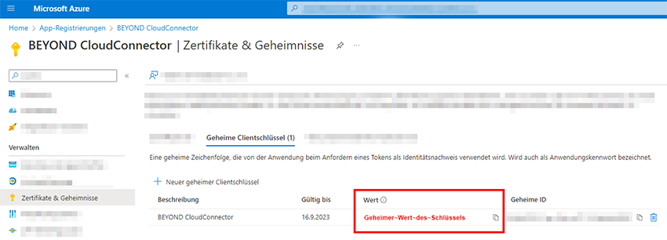  
1. Bewegen Sie den Mauszeiger auf den angezeigten Wert unter der Spalte **Wert**. Es wird ein Symbol eingeblendet, dass es Ihnen ermöglicht, den Wert in den Zwischerspeicher zu kopieren.  
1. Kopieren Sie den Wert.  
1. Fügen Sie den Wert in der PDF-Datei unter dem Feld **Client-Secret** ein.  

>[!NOTE]  
>**Geheimer Schlüssel werden nur unmittelbar nach Erstellung angezeigt**  
Der angezeigte Wert für den geheimen Schlüssel wird nur in dieser Session angezeigt. Wenn das Browserfenster geschlossen wird oder Sie sich abmelden, wird der Wert unkenntlich gemacht und kann nicht mehr kopiert werden. Sie benötigen den Wert des Schlüssels für die Anbindung von Sharepoint/Beyond CloudConnector zu Microsoft Dynamics 365 Business Central (siehe Abschnitt [CloudConnector in Business Central anbinden](#connect-cloudconnector-in-business-central)).  

### Autorisierungs-URL kopieren

In diesem Unterabschnitt wird beschrieben, woher Sie die Information **Autorisierungs-URL** für die Einrichtung von BEYOND CloudConnector in Business Central erhalten.  

1. Öffnen Sie die Webseite für Microsoft Azure [http://www.portal.azure.com/](http://www.portal.azure.com/) und melden Sie sich an.  
1. Klicken Sie in der Menüleiste von Microsoft Azure auf den Menüpunkt **App-Registrierungen**.  
      
1. Die Seite **App-Registrierungen** wird angezeigt.  
1. Klicken Sie in der angezeigten Tabelle **App-Registrierungen** auf die Anwendung, die Sie im Abschnitt [Anwendung in Microsoft Azure registrieren](#register-app-in-azure) erstellt haben.  
1. Klicken Sie in der Menüleiste auf **Übersicht**.  
1. Klicken Sie in Microsoft Azure unter der Übersicht zu der registrierten Anwendung **BEYOND CloudConnector** in der Menüleiste auf **Endpunkte**. Die Autorisierungs-URL setzt sich aus den folgenden Bestandteilen zusammen:  
<a role="link" aria-disabled="true">https://login.microsoftonline.com/ihre-tenant-id/oauth2/v2.0/authorize</a>  
    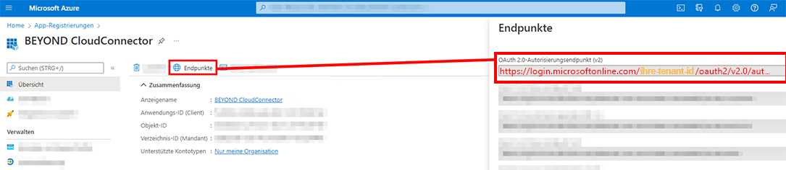  
1. Kopieren Sie aus Microsoft Azure den Feldwert für **OAuth 2.0-Autorisierungsendpunkt (v2)** und fügen Sie diesen in der PDF-Datei in das Feld **Autorisierungs-URL** ein.  

### Weiterleitungs-URL erstellen und kopieren

In diesem Unterabschnitt wird beschrieben, woher Sie die Information **Weiterleitungs-URL** für die Einrichtung von BEYOND CloudConnector in Business Central erhalten.  

1. Öffnen Sie die Webseite für Microsoft Azure [http://www.portal.azure.com/](http://www.portal.azure.com/) und melden Sie sich an.  
1. Klicken Sie in der Menüleiste von Microsoft Azure auf den Menüpunkt **App-Registrierungen**.  
      
1. Die Seite **App-Registrierungen** wird angezeigt.  
1. Klicken Sie in der angezeigten Tabelle **App-Registrierungen** auf die Anwendung, die Sie im Abschnitt [Anwendung in Microsoft Azure registrieren](#register-app-in-azure) erstellt haben.  
1. Klicken Sie in der Menüleiste auf **Authentifizierung**.  
1. Klicken Sie auf **Plattform hinzufügen**.  
    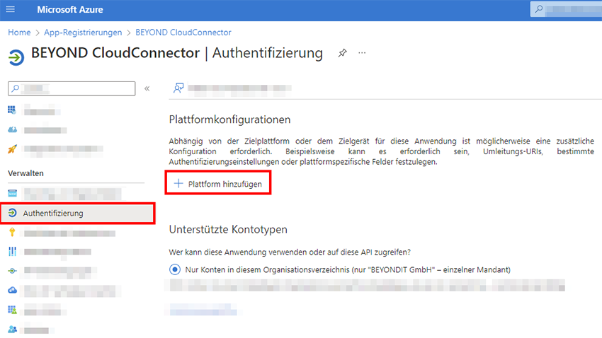  
1. Es wird ein Fenster angezeigt. Wählen Sie für die Plattform aus den Optionen **Web** aus.  
1. Fügen Sie in das Feld **Umleitungs-URIs** den nachfolgenden Link ein. Ersetzen Sie im Link Ihre Tenant-ID und den Enviroment-Namen.  
<a role="link" aria-disabled="true">https://businesscentral.dynamics.com/ihre-tenant-id/environment-name?page=70838577</a>.  
1. Kopieren Sie die Weiterleitungs-URL in die PDF-Datei unter dem Feld **Autorisierungs-URL**.  
1. Aktivieren Sie die Kontrollkästchen für die Optionen **Zugriffstoken** und **ID-Token**.  
1. Um die Weiterleitungs-URL zu erstellen, klicken Sie auf **Konfigurieren**.  
    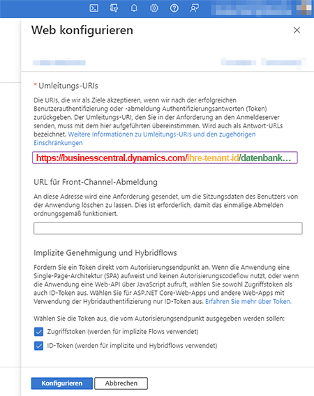  

### Zugriffstoken-URL kopieren

In diesem Unterabschnitt wird beschrieben, woher Sie die Information **Zugriffstoken-URL** für die Einrichtung von BEYOND CloudConnector in Business Central erhalten.  

1. Öffnen Sie die Webseite für Microsoft Azure [http://www.portal.azure.com/](http://www.portal.azure.com/) und melden Sie sich an.  
1. Klicken Sie in der Menüleiste von Microsoft Azure auf den Menüpunkt **App-Registrierungen**.  
      
1. Die Seite **App-Registrierungen** wird angezeigt.  
1. Klicken Sie in der angezeigten Tabelle **App-Registrierungen** auf die Anwendung, die Sie im Abschnitt [Anwendung in Microsoft Azure registrieren](#register-app-in-azure) erstellt haben.  
1. Klicken Sie in der Menüleiste auf **Übersicht**.  
1. Klicken Sie in Microsoft Azure unter der Übersicht zu der registrierten Anwendung **BEYOND CloudConnector** in der Menüleiste auf **Endpunkte**. Die Zugriffstoken-URL setzt sich aus den folgenden Bestandteilen zusammen:  
<a role="link" aria-disabled="true">https://login.microsoftonline.com/ihre-tenant-id/oauth2/v2.0/token</a>  
    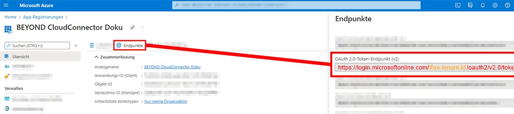  
1. Kopieren Sie aus Microsoft Azure den Feldwert für **OAuth 2.0-Token-Endpunkt (v2)** und fügen Sie diesen in der PDF-Datei in das Feld **Zugriffstoken-URL** ein.  

>[!NOTE]  
>**Ressourcen-URL**  
Die Information **Ressourcen-URL** wird vom System automatisch beim Erstellen der Cloud-Anwendung ergänzt.  

## CloudConnector mit Sharepoint in Business Central anbinden

In diesem Abschnitt wird beschrieben, wie Sie Sharepoint über Beyond CloudConnector in Microsoft Business Central anbinden.  

Um Sharepoint über die Extension Beyond CloudConnector in Microsoft Dynamics 365 Business Central anzubinden, gehen Sie wie folgt vor:  

1. Öffnen Sie Ihr Business Central und die PDF-Datei mit den gesammelten Daten.  
1. Rufen Sie aus dem Rollencenter die Suchfunktion auf (**ALT+Q**) 🔍.  
1. Suchen Sie nach der Seite **[Cloud Anwendungen](https://businesscentral.dynamics.com/?page=70838580)** und klicken Sie auf das entsprechende Suchergebnis.  
1. Die Seite **Cloud Anwendungen** wird angezeigt.  
1. Um Sharepoint an ihr Business Central anzubinden, klicken Sie in der Menüleiste auf **Neu**.  
1. Die Seite **Cloud Anwendung** wird angezeigt.  
    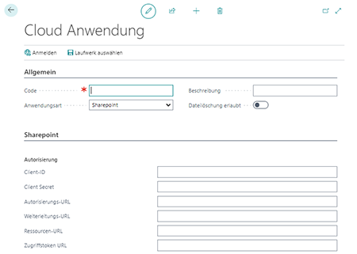  
1. Geben Sie im Feld **Code** den Wert **Sharepoint** an.  
1. Die Information **Ressourcen-URL** wird automatisch vom System ergänzt.  
1. Im Feld **Anwendungsart** wählen Sie aus dem Dropdownmenü den Wert **Sharepoint** aus.  
1. Im Feld **Beschreibung** können Sie eine Beschreibung für die neue Cloud-Anwendung eingeben.  
1. Über den Schieberegler **Dateilöschung erlaubt** steuern Sie, ob in der Cloud gespeicherte Dateien über Business Central gelöscht werden können.  
1. Öffnen Sie die PDF-Datei mit den gespeicherten Daten. Die PDF-Datei und die Daten haben Sie bereits in dem Abschnitt [Zugriffsdaten vorbereiten](#prepare-access-data) erhoben.  
1. Kopieren Sie die Daten aus der PDF-Datei und fügen Sie diese auf der Seite **Cloud Anwendung** unter dem Register **Sharepoint** ein.  
1. Wenn Sie die Daten eingetragen haben, klicken Sie in der Menüleiste auf die Option **Laufwerk auswählen**.  
1. Es wird ein Fenster eingeblendet. Wählen Sie die Sharepoint-Webseite (Dokumentenbibliothek in Sharepoint) aus, mit der Sie sich verbinden möchten.  
    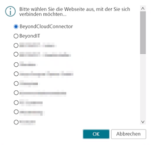  
1. Klicken Sie auf **OK**.  

Sie haben Ihren Sharepoint an Microsoft Dynamics 365 Business Central angebunden.  
Für eine vollständige Einrichtung müssen Sie noch die Tabellen definieren, auf denen die Dropzones zur Ablage von Dateien aus Business Central in Sharepoint angezeigt werden sollen. Weitere Informationen zur Einrichtung von Dropzones erhalten Sie unter dem Kapitel [Dropzone einrichten](set-up-dropzone.md).  

Sie können auch eine automatische Berichtsarchivierung einrichten. Weitere Informationen dazu finden Sie unter dem Kapitel [Berichtsarchivierung einrichten](set-up-report-archive.md).  

