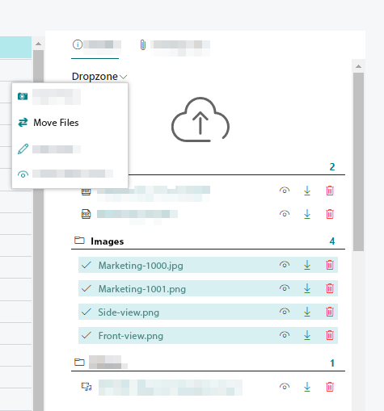

# Move Files to a Different Category

When uploading files to cloud storage, you are prompted to specify a category per file. The following instructions describe how to move one or more files to a different category.  

To do this, proceed as follows: 

1. If the FactBox with the Dropzone is not yet displayed, show it with the keyboard combination **ALT+F2**.  
      
1. In the drop zone, click the icons in front of the file names to select individual files. Alternatively, you can select all files in a category by clicking the icon in front of the category name.  
1. A check mark icon will be displayed in front of the selected files.  
1. To move the files to another category, click the dropdown menu in the Dropzone.  
      
1. Select **Move File** from the dropdown menu.  
1. The **Select Category** window is displayed.  
1. Select the category to which you want to move the selected files.  
1. To move the files to the selected category, click **OK**.  

You have moved the files to the category.  
For more information on how to set up categories, see the chapter [Set Up Categories for Dropzone](../setup/set-up-categories-for-dropzone.md).  
