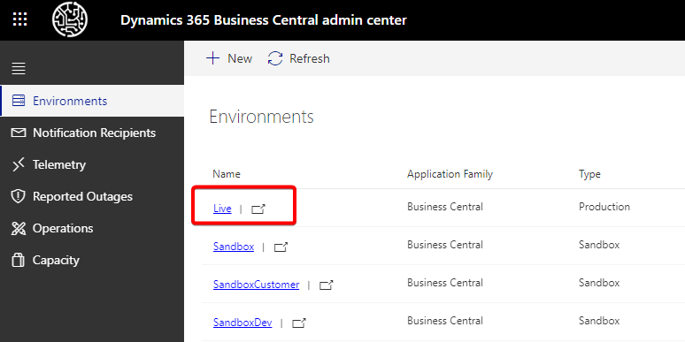
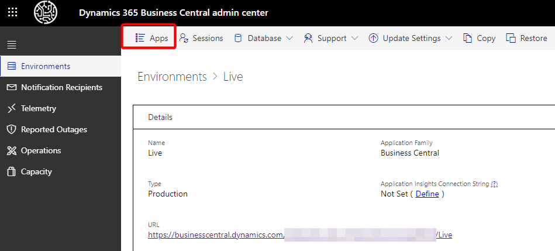
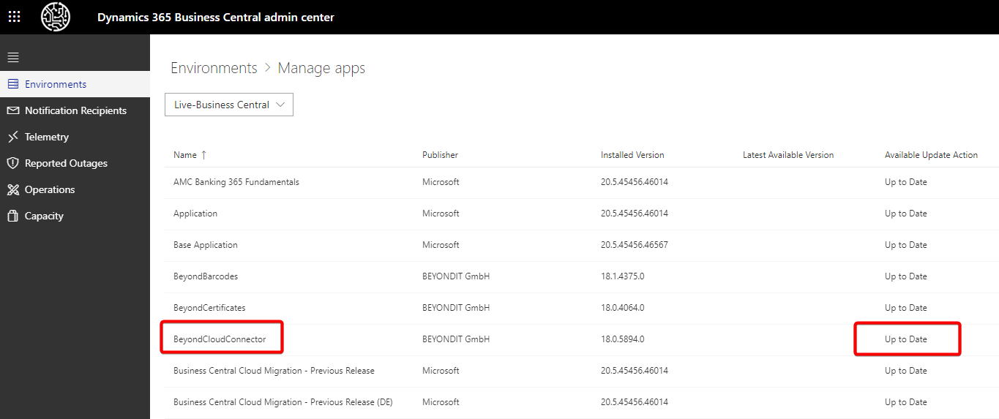

# Update to the latest version of CloudConnector

This chapter describes how to manually update BEYOND CloudConnector to the latest version.  

BEYOND CloudConnector is a living product, which means we are continuously working on further development and user experience. Through exchanges with our customers, we investigate use cases and implement the resulting improvements. The latest version is usually installed with the next Microsoft update, but you also have the option to manually update your apps before the update.  

To manually install the latest version of BEYOND CloudConnector for your Business Central, proceed as follows:  

1. Open the Admin Center. You can reach the Admin Center via the following URL:
    

    https://businesscentral.dynamics.com/
    your-directory-id
    /admin.  
    
  
1. Select the appropriate database for which you want to perform the update.  
      
1. Click **Apps** in the menu bar.  
      
1. The list shows all installed apps for the selected environment.  
      
1. Navigate to the **BeyondCloudConnector** app and check the status.  
1. If an update is available, you can perform the update via an action.  

Please note that an update is performed by Microsoft at regular intervals. In the course of this Microsoft update, app updates are also installed. It is therefore possible that the latest version of BeyondCloudConnector is already installed.  

If you need help with the update or have any questions regarding this, please feel free to contact us at the mail address 
<a href="mailto:info@beyondit.gmbh?cc=sascha.fischer@beyondit.gmbh&amp;subject=How to Update BeyondCloudConnector">info@beyondit.gbmh</a>.  