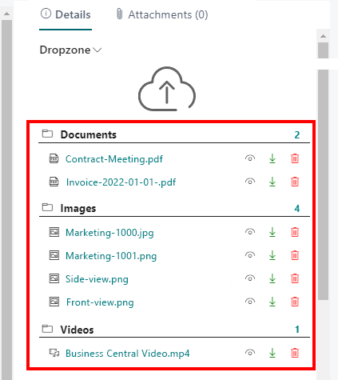
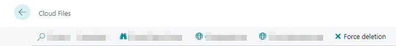

# Delete Files

This chapter describes how to delete files in the cloud storage via Business Central.  

<!-- :::info   -->  
**Deleting files**  
Delete files only when you are absolutely sure that they are no longer needed. If you delete files directly in cloud storage, the connection/link to the file will still appear in Business Central, but the connected file will not be opened. Administrators can delete files that are no longer linked from the records. To delete files and file connections, follow only the steps described in this chapter. For more information on deleting file connections, see the [Delete Connections to Files Saved in the Cloud](#delete-connection-to-files-saved-in-the-cloud) section.  
<!-- ::: -->

1. If the FactBox with the Dropzone is not yet displayed, press **ALT+F2** to display it.  
      
1. Click the trash can icon in the Dropzone to delete the file.  
1. You will be asked if you really want to delete the file. Confirm the message with **Yes**.  

You have deleted the file in the cloud storage and the specific file connection between Business Central and the connected cloud storage. Restoring the file to the cloud storage does not restore the link to Business Central. You have to re-upload the corresponding file via Business Central.  

## Delete Connections to Files Saved in the Cloud

This section describes how to delete a file connection. 
You must delete the file connection if the file to be displayed in Business Central (in the Dropzone) has been deleted from the connected cloud storage.  

To delete the file conection between Business Central and the cloud storage, proceed as follows:  

1. Note the name of the file and its metadata.  
1. From the role center, open the search function (**ALT+Q**) </img>.  
1. Search for **[Cloud Files](https://businesscentral.dynamics.com/?page=70838576)** and click on the corresponding search result. 
The **Cloud Files** page is displayed.  
1. Show the filter area (**SHIFT+F3**).  
1. Define a filter for the file based on the file name (or metadata, if applicable).  
1. Select the file whose file link you want to delete.  
1. Click **Force Deletion** in the menu bar.  
      

You have successfully deleted the file connection.  

>[!NOTE]  
>**Delete File Connection**  
Note that the file connection in Business Central to the file in cloud storage is deleted. When you restore the file to cloud storage, it **does not** appear in Business Central. To restore the link to the file, you must upload the file for the corresponding record using the drop zone. For more information, see the [Upload files](upload-files.md) chapter.  