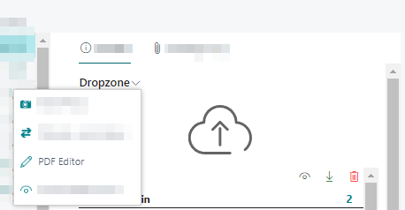
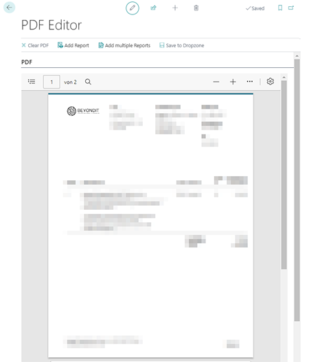

# Merge PDF Files

BeyondCloudConnector allows you to merge two or more PDF files into one file.  

To merge two or more pdf files, proceed as follows:  

1. Show the FactBox (**ALT+F2**) on the corresponding card.   
1. The FactBox with the Dropzone is displayed.  
1. To select the PDF file, click the icon in front of the PDF file name in the Dropzone.  
1. A check mark icon will be displayed in front of the selected file.  
1. To open the PDF editor for combining PDF files, click **Dropzone**.  
1. Click **PDF Editor**.  
      
1. The PDF Editor is displayed.  
      
1. To merge the PDF file with a PDF report, click **Add Report**. You can attach more than one PDF file using the **Add Multiple Reports** action.  
1. The **Report Lookup** window opens.  
1. Select the report or reports you want to merge with the PDF selected from the Dropzone.  
1. Click **OK**.  
1. A new window will be displayed. Define the report parameters.  
1. To merge the report or reports, click **OK**.  
1. To save the merged PDF, click **Save to Dropzone** in the menu bar of the **PDF Editor** page. The **Clear PDF** function allows you to delete the contents of the PDF file.  
1. Specify the file name for the newly created PDF file.  
1. Click **OK**. If you have set up categories for the Dropzone, you are prompted to specify a category for the file.  
1. Select the category and confirm the dialog box with **OK**.  

The file has been added to the Dropzone. You can now view it in the file preview or edit it using the additional functions for PDF file in the file preview. For more information about the file preview and the different editing options (depending on the file format), see the [Show File Preview](preview-files.md) chapter.  

