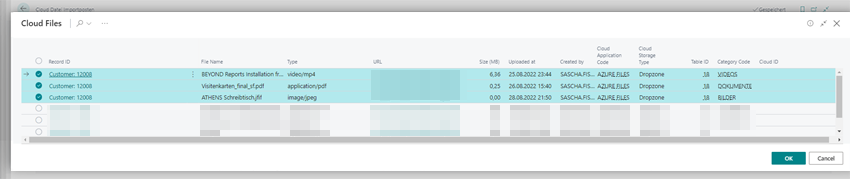
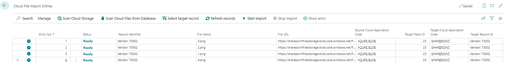

# Move Files to a Different Cloud Storage

BeyondCloudConnector allows to move files between two cloud storages (for example, to use a more suitable cloud storage or to save costs).  

<!-- :::info   -->
**Increased System Load**  
Note that copying files between two records ties up a lot of system resources. The system may become busy if a large number of files are copied, i.e. operation may be impaired. Do not perform this function with large amounts of data and, if possible, outside opening or business hours.  
<!-- ::: -->

Follow these steps to move files between two cloud storages using BeyondCloudConnector:  

1. Open your Business Central.   
1. From the role center, open the search function (**ALT+Q**) 🔍.  
1. Search for the **[Cloud File Import Entries](https://businesscentral.dynamics.com/?page=70838585)** page and click the appropriate search result.  
1. The **Cloud File Import Entries** page is displayed.  
1. From the menu, click **Scan Cloud Files from Database**.  
      
1. The **Edit – Scan Cloud Files…** window is displayed.  
1. Enter the application code of the cloud storage to which you want to transfer the filess in the **New Cloud Application Code** field.  
1. Click **OK**.  
1. The **Cloud Files** window is displayed. This list displays all files from all cloud storages that are linked via Business Central.  
1. Select the files you want to move to the new cloud storage.  
      
1. Click **OK**. The selected files are displayed in the **Cloud Files Import Entries** list. Under the **Source Cloud Application Code** column, the current cloud location (application code) of the files is displayed. Under the **Target Cloud Application Code** column, the new cloud location (application code) of the files is displayed.  
      
1. Select the files and click **Start import** in the menu bar.  
1. The files are moved to the new cloud storage.  

You have moved the files to another cloud storage.  

If you want to copy one or more files to another record (Dropzone), you can upload the files using the corresponding Dropzone area or copy them in batch using the cloud file import entries. For more information on this topic, see the [Copy Files to a Different Record](copy-files-to-different-record.md) chapter.  