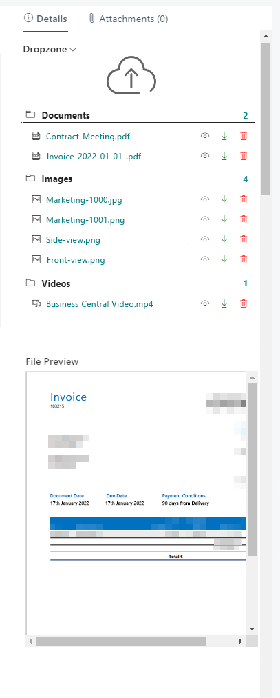
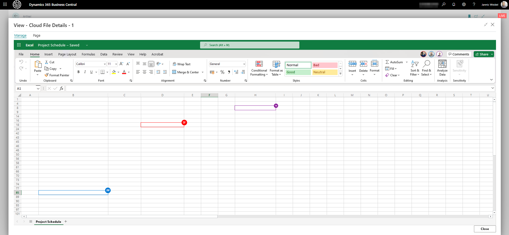

# Show File Preview

BeyondCloudConnector allows you to preview files stored in the cloud storage.  

<!-- :::info   -->  
**User permissions required**  
The **File Preview Enabled** setting on the **Cloud Connector User Setup** page controls the file preview below the Dropzone for the corresponding tables. If the user does not have the permissions (**Dropzone Enabled** and **File Preview Enabled**), neither the Dropzone nor the file preview will be displayed to the user.  
<!-- ::: -->

Follow the steps below to preview a file stored in the cloud storage:  

1. Click the file name in the Dropzone.  
1. A reduced preview of the file is displayed in the info box area under the **File Preview** tab.  
      
1. If you want to see a larger preview of the file, click the eye icon next to the file in the Dropzone.  
1. The file view opens. In this file view, you can view the files stored in the cloud storage - without leaving Business Central.  
      
File preview allows handling files within Business Central (with multiple people), playing video files and editing PDF documents.  

BeyondCloudConnector offers a wide range of functions for editing files. All of these functions can be performed in the file preview (eye icon). Below is an overview, sorted by file type, of the functions you can perform on files stored in the cloud within the file preview via Business Central:  

|**Dateityp**|**Funktion zur Dateihandhabung**|
|:--|:--|
|PDF-Datei *(.pdf)*|Seiten in PDF-Datei drehen, Text hinzufügen, Text hervorheben, Formen zeichnen, Änderungen rückgängig machen, Änderungen speichern, PDF-Datei drucken, PDF-Datei vorlesen|

|**Dateityp**|**Funktion zur Dateihandhabung**|
|:--|:--|
|Excel-Dateien, Word-Dateien, PowerPoint-Dateien, OneNote-Dateien *(.xlsx, .docx, .pptx, .one)*|Gleichzeitiges Arbeiten mit anderen Mitarbeitern an einer Datei in und außerhalb von Business Central in Echtzeit|

|**Dateityp**|**Funktion zur Dateihandhabung**|
|:--|:--|
|Video-Dateien *(.mpg, .mpeg, .mp4, .avi, .wmv, .mov, .flv, .webm, …)*|Wiedergabe mit verschiedenen Optionen: *In Vollbild abspielen* *In Bild-in-Bild abspielen* *Wiedergabegeschwindigkeit ändern* *Lautstärke ändern*|

<!-- :::info   -->  
**PDF-Dateien zusammenführen**  
BeyondCloudConnector bietet Ihnen neben den oben genannten Funktionen in der Vorschau auch die Möglichkeit, mehrere PDF-Dateien zu einer PDF-Datei zusammenzuführen. Weitere Informationen dazu erhalten Sie unter dem Kapitel [PDF-Dateien zusammenführen](merge-pdf-files.md).  
<!-- ::: -->