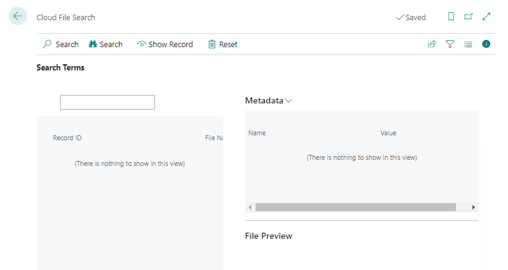
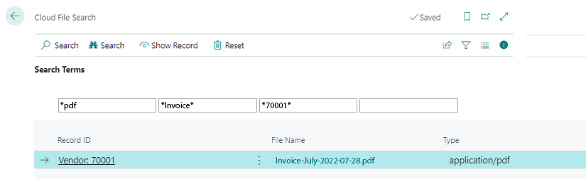

# Search Files

This chapter describes how to search for files in Business Central via BeyondCloudConnector in the connected cloud storage. Metadata and categories stored on the files can be defined as search criteria.  

Follow these steps to search for a file in cloud storage via BeyondCloudConnector:  

1. Open your Business Central.   
1. From the role center, open the search function (**ALT+Q**) 🔍.  
1. Search for the **[Cloud Files Search](https://businesscentral.dynamics.com/?page=70838588)** page and click on the corresponding search result.  
1. The **Cloud Files Search** page is displayed.  
      
1. Enter a search criterion in the input field.  
1. Click **Search** in the menu bar.  
1. If necessary, narrow down the search results by defining additional search criteria. You can also use metadata and categories as search criteria.  
      
1. Click **Show Record** in the menu bar to navigate directly to the record.  
1. You can open the file you are looking for in the FactBox (**ALT+F2**) in the Dropzone. Click on the eye symbol next to the file name.  

You have found your file. If the file cannot be accessed via the Dropzone, this may be because the file has been deleted from the cloud storage, but the link is still stored in Business Central. For more information, see the chapter [Delete Files](delete-files.md).  
