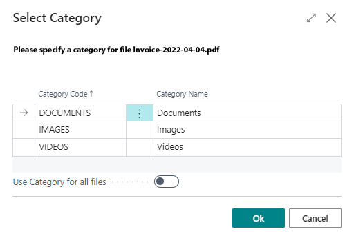

# Upload Files

BeyondCloudConnector allows you to upload files to your cloud storage via the **Dropzone**. The Dropzone must be set up to upload files. For more information, please refer to the chapter [Set Up Dropzone](../setup/set-up-dropzone.md).  

For the following description, we assume that you are on a page, table, or card for which a Dropzone is set up and you have the appropriate user permissions to view the Dropzone.  

To upload a file to the cloud storage, do the following:  

1. Display the FactBox in Business Central (**ALT+F2**).  
1. The Dropzone is displayed at the upper part of the FactBox.  
      
1. Click the upload icon in the Dropzone and select the file you want to upload. Alternatively, you can also drag and drop the files onto the Dropzone. This is especially helpful if you want to upload multiple files at once.  
1. If you have set up categories for the Dropzone, a window will prompt you to assign the file(s) to a category. For more information on categories, see the [Set Up Categories for Dropzone](../setup/set-up-categories-for-dropzone.md) chapter.  
      
1. The **Use Category for all files** slider allows you to apply the selected category to all files to be uploaded (if you are uploading multiple files).  
1. Click **OK** to upload the file.  
      

In the FactBox below the Dropzone, the corresponding category is displayed with the file you uploaded. If you click on a file, the file is displayed in the file preview below the Dropzone in the Factbox. For more information about previewing files and the possible functions, see the [Show File Preview](preview-files.md) chapter.  