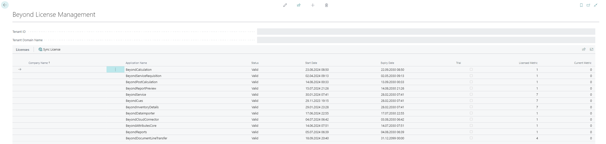

# License Management

This chapter describes how you can view the license management of **Beyond CloudConnector**.  

To view the status of the product license for **Beyond CloudConnector**, proceed as follows:  

1. Open the search field (ALT+Q) and search for the page **[Beyond License Management](https://businesscentral.dynamics.com/?page=70838792)**.  
1. The **Beyond License Management** page is displayed.  
      
1. Under the **Licenses** section, you will find all product licenses for BeyondIT applications that have been installed for this company. You can read all the necessary information from the values in the columns:  

|**Column**|**Desccription**|
|:--|:--|
|**Company Name**|This column indicates the name of the company.|
|**Application Name**|This column indicates the name of the application. If you use several BeyondIT products, a separate line is displayed for each product in the overview.|
|**Status**|This is the status of the product license. Several values are possible: **Valid**: The product license is valid and the application can be used without restrictions.**Expired**: The product license has expired. The application can no longer be used. **Trial**: The product license is valid and the functionalities of the application can be used for a short period of time (note the value in the **expiry date** column) with restrictions or without restrictions.  **Exceeded**: The product license has expired. The application can no longer be used.|
|**Start Date**|This is the date on which the product license was registered.|
|**Expiry Date**|This is the date on which the product license becomes or became invalid. The application can no longer be used.|
|**Trial**|This checkbox indicates whether the product license is a trial license. Trial licenses are very limited licenses. You can purchase a full product license after the trial license expires (note the value in the **Expiry date** column).|
|**Licensed Metric**|This column shows how the application was licensed. For example, this can be a tenant license, a license per company or a license per user.|
|**Current Metric**|This column shows how many licenses are used in the environment. The difference between the values in the **Licensed metric** and **Current metric** columns indicates whether you need to purchase an additional license.|