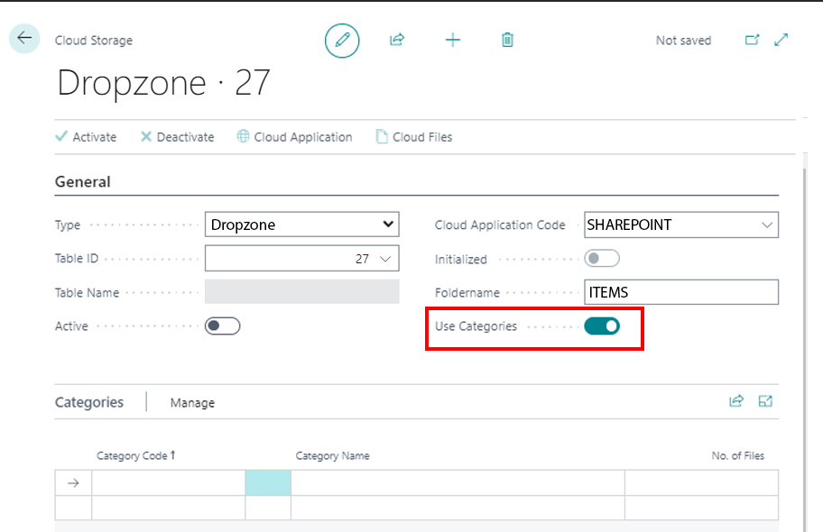
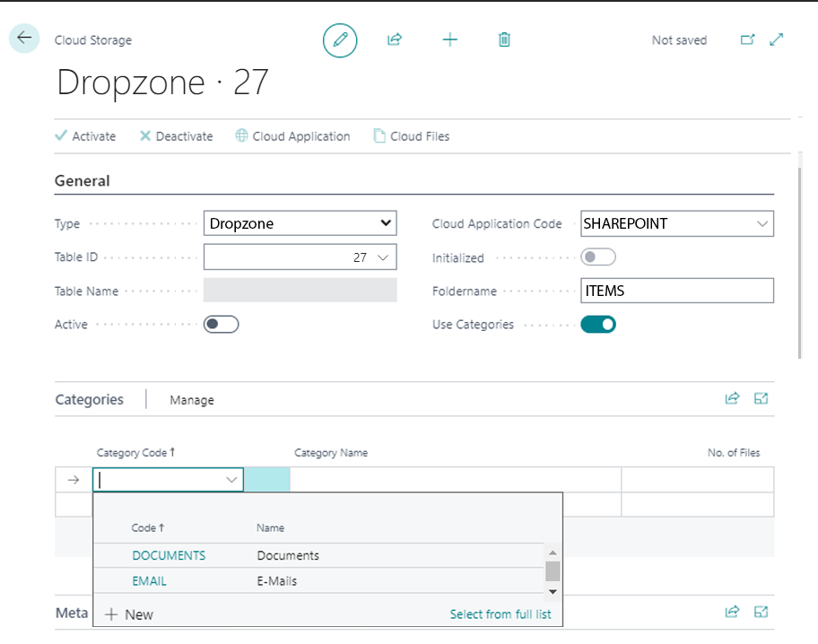
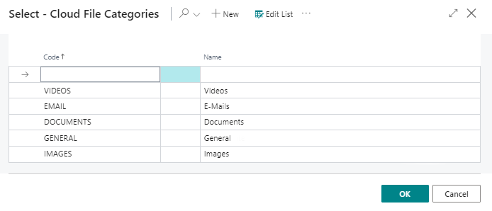
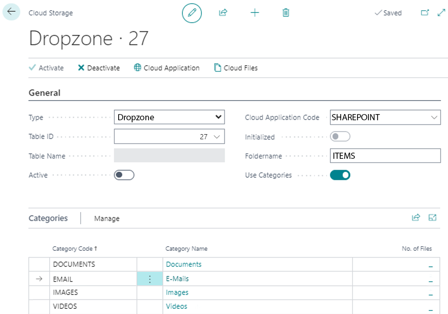

# Set Up Categories for Dropzone

This section describes how to set up categories for a Dropzone. Categories allow you to store files in a structured way and make it easier to search and find files in a record.  

When setting up a Dropzone for a table, you have the option to enable the **Use Categories** option.  
          
If the slider is activated, the **Categories** tab is displayed. Here you can create categories for the Dropzone.  
          

To create categories for the Dropzone, proceed as follows:  

1. Open your Business Central.   
1. From the role center, open the search function (**ALT+Q**) </img>.  
1. Search for **[Cloud Storages](https://businesscentral.dynamics.com/?page=70838580)** and click the appropriate search result.
The **Cloud Storages** page is displayed.  
1. Select a cloud storage from the list and open the corresponding cloud storage card.  
1. Under the **Categories** tab, click in an empty row under the **Category Code** column.  
          
1. Select **New** from the menu that is displayed.  
1. The **Select - Cloud File Categories** window is displayed.  
1. Under the **Code** column, enter a code for the category. For example, you can use the **IMAGES** code to create a category for images.  
1. Enter the name for the category under the **Name** column. Repeat the previous step if you want to create more categories.  
1. Click **OK** to save the newly created category/categories.  
          
1. You will be redirected back to the cloud storage card.  
1. Under the **Categories** tab, specify the categories you created.  
          

You have added one or more categories to this Dropzone. 
Note that the cloud storage (i.e. the Dropzone) is **Active** to be able to use the categories. When uploading files, you will now be asked which category the file corresponds to. For more information, see the [Upload Files](../features/upload-files.md) chapter.  