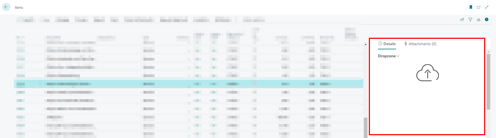

# Set Up Dropzone

This chapter describes how to set up a Dropzone in Business Central. The Dropzone allows you to upload files to your cloud storage ([Sharepoint](set-up-for-sharepoint.md), [Azure Files](set-up-for-azure-files.md), or [Azure Blob Storage](set-up-for-azure-blob-storage.md)) and as well as access those files in Business Central.  

The following description explains how to set up a Dropzone for items.  

1. Open your Business Central.   
1. From the role center, open the search function (**ALT+Q**) 🔍.  
1. Search for **[Cloud Storage](https://businesscentral.dynamics.com/?page=70838580)** and click on the appropriate search result.
The **Cloud Storage** page is displayed.  
1. To set up a new Dropzone, click **New** in the menu bar.  
1. From the **Type** dropdown list, select **Dropzone**.  
      
1. From the **Table ID** dropdown list, select the table for which you want to add a Dropzone. Note that the Dropzone can only be added for tables that are stored in this dropdown list. To set up a Dropzone for items, enter the ID **27** in this field.  
1. After specifying the table ID, the **Table Name** field is automatically filled by the system.  
1. In the **Cloud Application Code** field, specify the cloud application you want to use to store the data.  
1. In the **Folder Name** field, specify a name for the folders to be created in the cloud storage hierarchy to store the uploaded data. This field defaults to the name for the table ID.  
1. **<u>Optional</u>**: Activate the **Use Categories** slider to save files into freely definable categories (for example into images, videos, e-mails and PDF documents). The categories can also be used as search criteria when searching for files. For more information about categories, see the section [Set Up Categories For Dropzone](set-up-categories-for-dropzone.md).  
1. Under the **Metadata** tab, you can define additional information that is stored when files are uploaded to the cloud storage via the Dropzone. The metadata can be defined as a search criterion when searching for files in the cloud (see chapter [Search Files](../features/search-files.md)).  
1. Click **Activate** in the menu bar to add the Dropzone to the table. The **Active** slider will be grayed out, indicating that this Dropzone is set up correctly.  

You have set up the Dropzone. The Dropzone is displayed on the set tables in the FactBox (**ALT+F2**).  
      

For more information about the Dropzone functions, see the chapters:  

+ [Upload Files](../features/upload-files.md)  
+ [Delete Files](../features/delete-files.md)  
+ [Show File Preview](../features/preview-files.md)  
+ [Merge PDF Files](../features/merge-pdf-files.md)  
+ [Move Files to Different Category](../features/move-files-to-different-category.md)  