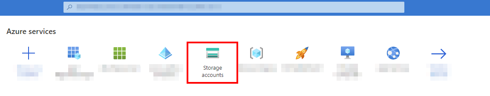
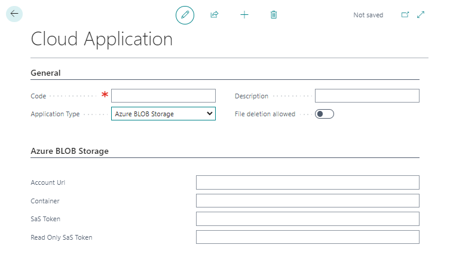

# Set Up Azure Blob Storage as Cloud Storage

This chapter describes how to connect your Business Central (using BeyondCloudConnector) to Azure Blob Storage.  
Connecting Azure Blob Storage allows you to directly access and edit files stored in the cloud without leaving Business Central.  

<!-- :::info   -->
**Adminstator Privileges required in Microsoft Azure**  
The following descriptions require administrator privileges in Microsoft Azure. To set up the connection, you must have permission to create storage accounts and containers, and to create SAS tokens. If you need help with setup or have any questions in this regard, please feel free to contact us at 
<a href="mailto:info@beyondit.gmbh?cc=sascha.fischer@beyondit.gmbh&amp;subject=Set Up Azure Blob Storage as Cloud Storage">info@beyondit.gbmh</a>.  
<!-- ::: -->

Please download the file from the link below:  
<a href="http://docs.beyond365.de/en-US/cloudconnector/assets/en-US_CloudConnectorAzureBlobStorageSetup.pdf" download>
  <button>Download</button>
</a>
<a href="http://docs.beyond365.de/en-US/cloudconnector/assets/en-US_CloudConnectorAzureBlobStorageSetup.pdf">Download PDF File</a>

Follow the steps below to connect Azure Blob Storage in Business Central:  

+ [Create Storage Account in Microsoft Azure](#create-storage-account)  
+ [Generate Shared Access Signatures](#create-sas)  
+ [Connect BeyondCloudConnector with Azure Blob Storage in Business Central](#connect-cloudconnector-in-business-central)  

## Create Storage Account in Microsoft Azure

This section describes how to create a storage account in Microsoft Azure. The storage account provides a unique namespace for your Azure storage data that can be accessed from anywhere in the world using HTTP or HTTPS. Data in your storage account is persistent and highly available, secure, and extremely scalable.   

1. Open the website [http://www.portal.azure.com/](http://www.portal.azure.com/) and log in.  
1. In the Microsoft Azure menu bar, click **Storage Accounts**.  
      
1. Click **Create** in the menu bar.  
1. Complete the required information to create a new storage account. We recommend that you name the storage account **beyondcloudconnector**. Since storage account settings depend largely on your organization's policies, we do not provide any values. For more information about storage account settings and how to create a storage account, see the Microsoft Azure Help chapter [Create a storage account](https://learn.microsoft.com/en-us/azure/storage/common/storage-account-create?tabs=azure-portal).  
1. For the storage account, click **Endpoints** under the **Settings** menu item.  
1. Copy the value for the **File Service** and enter it in the PDF file under the **Account URL** field.  
1. Create a container for the storage account.  
1. Enter the name of the created container in the PDF file under the **Container** field. 

You have created a new storage account with a container. Two Shared Access Signatures (SAS) are still missing to set up the cloud storage. The SAS are created under the [Generate Shared Access Signatures](#create-sas) section.  

## Generate Shared Access Signatures

This section describes how to create the two Shared Access Signatures (SAS) to set up Azure Blob Storage for BEYOND CloudConnector.  

1. Open the website [http://www.portal.azure.com/](http://www.portal.azure.com/) and log in.  
1. In the Microsoft Azure menu bar, click **Storage Accounts**.  
1. Select the storage account that you created in the [Create Storage Account in Microsoft Azure](#create-storage-account) step.  
1. Click **Shared Access Signature** in the menu bar under the **Security + Networking** section.  
      
1. Under the **Allowed Permissions** section, enable all permissions for the SAS.  
1. Generate the SAS and enter it in the PDF document under the **SAS Token** field.  
1. Then generate another SAS. For this SAS, clear all the check boxes under the **Allowed Services** section except for the **Read** permission.  
1. Copy the SAS (read permissions only) string into the PDF file in the **Read only SAS Token** field.  

You have created the SAS.  

## Connect BeyondCloudConnector with Azure Blob Storage in Business Central

This section describes how to connect Azure Blob Storage via BeyondCloudConnector in Microsoft Business Central.  

To connect Azure Blob Storage via the BeyondCloudConnector extension in Microsoft Dynamics 365 Business Central, proceed as follows:  

1. Open your Business Central and the PDF file with the collected data.  
1. From the role center, open the search function (**ALT+Q**) 🔍.  
1. Search for **[Cloud Applications](https://businesscentral.dynamics.com/?page=70838580)** and click on the corresponding search result.  
1. The **Cloud Applications** page is displayed.  
1. To connect Azure Blob Storage to your Business Central, click **New** in the menu bar.  
1. The **Cloud Application** page is displayed.  
      
1. In the **Code** field, specify the value **Azure Blob Storage**.  
1. In the **Application Type** field, select **Azure Blob Storage** from the dropdown menu.  
1. In the **Description** field, you can enter a description for the new cloud application.  
1. Use the **File Deletion Allowed** slider to control whether files stored in the cloud can be deleted via Business Central.  
1. Open the Azure Blob Storage setup PDF file that you filled with information in the previous sections and transfer the values to the appropriate fields in Business Central.  

You have connected Azure Blob Storage to Microsoft Dynamics 365 Business Central.  
For a complete setup, you still need to define the tables on which you want the dropzones to appear for storing files from Business Central in Azure Blob Storage. For more information about setting up Dropzones, see the [Set Up Dropzone](set-up-dropzone.md) chapter.  

You can also set up automatic report archiving. For more information, see the chapter [Set Up Report Archive](set-up-report-archive.md).  