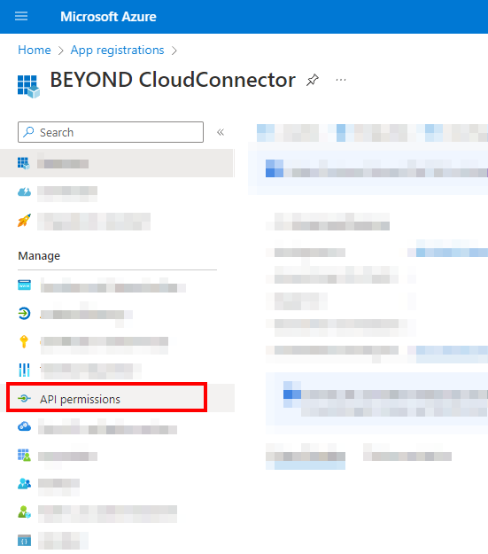

# Set Up Sharepoint as Cloud Storage

This chapter describes how to connect your Business Central (using BeyondCloudConnector) to Sharepoint.  
Connecting Sharepoint allows you to directly access and edit files stored in the cloud without leaving Business Central.  

<!-- :::info   -->
**Adminstator Privileges required in Microsoft Azure**  
The following descriptions require administrator privileges in Microsoft Azure. To set up the connection, you must have permission to create storage accounts, regsiter apps, add API permissions and create secret keys. If you need help with setup or have any questions in this regard, please feel free to contact us at 
<a href="mailto:info@beyondit.gmbh?cc=sascha.fischer@beyondit.gmbh&amp;subject=Set Up Sharepoint as Cloud Storage">info@beyondit.gbmh</a>.  
:::

Follow the steps below to connect Sharepoint in Business Central:  

+ [Register application in Microsoft Azure](#register-app-in-azure)
+ [Add API permissions](#grant-api-authorizations)
+ [Prepare access data](#prepare-access-data)
  + [Copy Application (Client) ID](#copy-client-id)
  + [Generate and copy secret](#create-and-copy-secret)
  + [Copy Authorization URL](#copy-authorization-url)
  + [Create and copy Redirect URL](#create-and-copy-redirect-url)
  + [Copy Access Token URL](#copy-access-token-url)
+ [Connect BeyondCloudConnector with Sharepoint in Business Central](#connect-cloudconnector-in-business-central)

## Register application in Microsoft Azure

This section describes how to register the application (BeyondCloudConnector) in Microsoft Azure.  
To do this, proceed as follows:  

1. Open the website [http://www.portal.azure.com/](http://www.portal.azure.com/) and log in.  
1. In the Microsoft Azure menu bar, click **App Registrations**.  
      
1. The **App Registrations** page is displayed. Click **New Registration** in the menu bar.  
      
1. Enter a suitable name for the new application under **Name**. We recommend using the name **BEYOND CloudConnector**.  
1. Under **Supported Account Types**, select the **Accounts in this organizational directory only** option.  
1. To complete the application registration, click **Register**.  

You have registered a new application in Microsoft Azure. You need to give this registered application (**BEYOND CloudConnector**) the appropriate API permissions to connect to Business Central, Microsoft Graph and Sharepoint.  

## Add API permissions

This section describes how to configure the API permissions required for data exchange (Read, Write and Manage). You need to configure permissions for three program interfaces (APIs). The interfaces used are Sharepoint, Dynamics 365 Business Central, and Microsoft Graph.  

To add the API permissions, do the following:  

1. If you have not yet opened the Microsoft Azure web page, click on the link below and log in:  
[http://www.portal.azure.com/](http://www.portal.azure.com/).  
1. In the Microsoft Azure menu bar, click the **App Registrations** menu item.  
      
1. The **App Registrations** page is displayed.  
1. In the **App Registrations** table that is displayed, click the application that you created in the [Register application in Microsoft Azure](#register-app-in-azure) section.  
      
1. The corresponding app registration page is displayed.  
1. To view the permissions for the registered app, click **API Permissions** in the menu.  
      
1. To add the permission for **Dynamics 365 Business Central**, click the **Add a Permission** option under the **Configured Permissions** section.  
      
1. The **Request API Permissions** window is displayed.  
      
1. Select **Dynamics 365 Business Central** from the available API permission options.  
1. Choose the permission type **Delegated permissions**.  
1. Select the **Financials.ReadWrite.All** checkbox.  
      
1. Click **Add Permissions**.  
1. You have granted permission for Dynamics 365 Business Central. This is displayed under the **Configured Permissions** section in your app registry.  
1. To add other required permissions (**Sharepoint**), click **Add a Permission** in the **Configured Permissions** area.  
      
1. Click on the **SharePoint**.  
      
1. Choose the permission type **Delegated permissions**.  
1. Select the **AllSites.Manage** checkbox.  
      
1. Click **Add Permissions**.  
1. You have granted permission for Sharepoint. Dynamics 365 Business Central and Sharepoint permissions are displayed under the **Configured Permissions** section in your app registration.  
1. To add the other required permissions (**Microsoft Graph**), click **Add a Permission** in the **Configured Permissions** area.  
      
1. Click on the API **Microsoft Graph**.  
      
1. Choose the permission type **Delegated permissions**.  
1. Select the **Files.ReadWrite.All** checkbox under the **Files** API Permissions.  
      
1. In addition to the **Files.ReadWrite.All** permission, scroll down to the **Sites** permission and select the checkbox for **Sites.Read.All**.  
      
1. Click **Add Permissions**.  
1. You have granted API permissions for Microsoft Graph.  
Dynamics 365 Business Central, Sharepoint, and Microsoft Graph permissions are displayed under the **Configured Permissions** section in your app registry.  
      
You have added all necessary permissions to connect Sharepoint via BeyondCloudConnector.

|**Dynamics 365 Business Central**|**Microsoft Graph**|**Sharepoint**|
|:--|:--|:--|
|• Financials.ReadWrite.All|• Files.ReadWrite.All|• AllSites.Manage|
||• Sites.Read.All|
||• User.Read|

## Prepare access data

To make the setup easier for you, we have prepared a PDF file for you. The PDF file caches information from Microsoft Azure (e.g. Application (Client) ID, Access Tokens, etc.) that you will need later for setup in Business Central.  

Please download the file from the link below:  
<a href="http://docs.beyond365.de/de-DE/cloudconnector/assets/en-US_CloudConnectorSharepointSetup.pdf" download>
<button>Download</button>
</a>
<a href="http://docs.beyond365.de/de-DE/cloudconnector/assets/en-US_CloudConnectorSharepointSetup.pdf">Download PDF file</a>

After downloading, open the PDF file and proceed to the following sections:  

+ [Copy Application (Client) ID](#copy-client-id)
+ [Generate and copy secret](#create-and-copy-secret)
+ [Copy Authorization URL](#copy-authorization-url)
+ [Create and copy Redirect URL](#create-and-copy-redirect-url)
+ [Copy Application AccessID URL](#copy-access-token-url)

### Copy Application (Client) ID

This subsection describes where to get the **Aopplication (Client) ID** information for the BeyondCloudConnector setup in Business Central.  

1. Open the website for Microsoft Azure [http://www.portal.azure.com/](http://www.portal.azure.com/) and log in.  
1. In the Microsoft Azure menu bar, click the **App Registrations** menu item.  
      
1. The **App Registrations** page is displayed.  
1. In the **App registrations** table that is displayed, click the application that you created in the [Register application in Microsoft Azure](#register-app-in-azure) section.  
1. Click **Overview** in the menu bar.  
1. Move the cursor to the **Application (Client) ID** value. An icon will appear that allows you to copy the value to the clipboard.  
      
1. Insert the value in the PDF file under the **Client ID** field.  

### Generate and copy secret

This subsection describes how to create a new secret key in your Microsoft Azure. The secret key (also called **Client Secret**) is required to secure the connection to Sharepoint and to authenticate yourself.  

To generate a secret key, proceed as follows:  

1. If you have not yet opened the Microsoft Azure web page, click on the link below and log in:  
[http://www.portal.azure.com/](http://www.portal.azure.com/)  
1. In the Microsoft Azure menu bar, click the **Certificates & Secrets** menu item.  
      
1. Select **New client Secret** from the menu bar.  
1. Under the **Description** field, enter a name for the key (for example, **BEYOND CloudConnector**).  
1. Under the **Expires** field, define the validity period of the key. We recommend that you specify the validity period as 12 months. Please note that a new key must be regenerated after this period/date expires.  
      
1. To create the key, click **Add**.  
1. The new secret key (client secret) will be added to the **Certificates & Secrets** page.  
      
1. Move the mouse cursor to the displayed value under the **Value** column. An icon will appear that allows you to copy the value to the clipboard.  
1. Copy the value.  
1. Insert the value in the PDF file under the **Client Secret** field.  

<!-- :::info   -->
**Values of secret keys are displayed only immediately after creation**  
The displayed value for the secret key is shown only in this session. When the browser window is closed or you log out, the value is made unrecognizable and can no longer be copied. You need the value of the key to connect Sharepoint/Beyond CloudConnector to Microsoft Dynamics 365 Business Central (see section [Connect BeyondCloudConnector with Sharepoint in Business Central](#connect-cloudconnector-in-business-central)).  
<!-- ::: -->

### Copy Authorization URL

This subsection describes where to get the **Authorization URL** information for setting up BEYOND CloudConnector in Business Central.  

1. Open the website for Microsoft Azure [http://www.portal.azure.com/](http://www.portal.azure.com/) and log in.  
1. In the Microsoft Azure menu bar, click the **App Registrations** menu item.  
      
1. The **App Registrations** page is displayed.  
1. In the **App registrations** table that is displayed, click the application that you created in the [Register application in Microsoft Azure](#register-app-in-azure) section.  
1. Click **Overview** in the menu bar.  
1. In Microsoft Azure, under the overview for the registered application **BEYOND CloudConnector**, click **Endpoints** in the menu bar. The authorization URL is composed of the following components: 

https://login.microsoftonline.com/your-directory-id/oauth2/v2.0/authorize

  

From Microsoft Azure, copy the field value for **OAuth 2.0 authorization endpoint (v2)** and paste it into the **Authorization URL** field in the PDF file.  

### Create and copy Redirect URL

This subsection describes where to get the **Redirect URL** information for BEYOND CloudConnector setup in Business Central.  

1. Open the website for Microsoft Azure [http://www.portal.azure.com/](http://www.portal.azure.com/) and log in.  
1. In the Microsoft Azure menu bar, click the **App Registrations** menu item.  
      
1. The **App Registrations** page is displayed.  
1. Klicken Sie in der angezeigten Tabelle **App-Registrierungen** auf die Anwendung, die Sie im Abschnitt [Register application in Microsoft Azure](#register-app-in-azure) erstellt haben.  
1. Click **Authentication** in the menu bar.  
1. Click **Add Platform**.   
      
1. A window will be displayed. Select **Web** from the options for the platform.  
1. Paste the following link in the **Redirect URI** field and replace the information "your-directory-id" and "/database-name" in the link.  
    

    https://businesscentral.dynamics.com/
    your-directory-id
    /database-name
    ?page=70838577.  
    

1. Copy the redirect URL into the PDF file under the **Redirect URL** field.  
1. Select the **Access Tokens** and **ID Tokens** checkboxes.  
1. To create the redirect URL, click **Configure**.  
      

### Copy Access Token URL

This subsection describes where to get the **Access token URL** information for BEYOND CloudConnector setup in Business Central.  

1. Open the website for Microsoft Azure [http://www.portal.azure.com/](http://www.portal.azure.com/) and log in.  
1. In the Microsoft Azure menu bar, click the **App Registrations** menu item.  
      
1. The **App Registrations** page is displayed.  
1. In the **App registrations** table that appears, click the application that you created in the [Register application in Microsoft Azure](#register-app-in-azure) section.  
1. Click **Overview** in the menu bar.  
1. In Microsoft Azure, under the overview of the registered application **BEYOND CloudConnector**, click **Endpoints** in the menu bar. The access token URL is composed of the following components:  

https://login.microsoftonline.com/
your-directory-id
/oauth2/v2.0/token

      
From Microsoft Azure, copy the field value for **OAuth 2.0 token endpoint (v2)** and paste it into the **Access token URL** field in the PDF file.  

<!-- :::info   -->
**Ressource URL**  
The **Ressource URL** is automatically added by the system when creating the cloud application.  
<!-- ::: -->

## Connect BeyondCloudConnector with Sharepoint in Business Central

This section describes how to connect Sharepoint to Microsoft Business Central using Beyond CloudConnector.  

To connect Sharepoint via the BeyondCloudConnector extension in Microsoft Dynamics 365 Business Central, proceed as follows:  

1. Open your Business Central and the PDF file with the collected data.  
1. From the role center, open the search function (**ALT+Q**) </img>.  
1. Search for the **[Cloud Applications](https://businesscentral.dynamics.com/?page=70838580)** page and click the corresponding search result.  
1. The **Cloud Applications** page is displayed.  
1. To connect Sharepoint to your Business Central, click **New** in the menu bar.  
1. The **Cloud Application** page is displayed.  
      
1. In the **Code** field, specify the value **Sharepoint**.  
1. The information **Resource URL** is automatically added by the system.  
1. In the **Application type** field, select **Sharepoint** from the drop-down menu.  
1. In the **Description** field, you can enter a description for the new cloud application.  
1. Use the **File Deletion Allowed** slider to control whether files stored in the cloud can be deleted via Business Central.  
1. Open the PDF file with the saved data. You have already collected the information for the setup in the [Prepare access data](#prepare-access-data) section.  
1. Copy the data from the PDF file and paste it on the **Cloud Application** page under the **Sharepoint** tab.  
1. When you are done with entering the data, click **Select Drive** from the menu bar.  
1. A window is displayed. Select the Sharepoint website (document libary in Sharepoint) which you want to connect to.  
      
1. Click **OK**.  

You have connected your Sharepoint to Microsoft Dynamics 365 Business Central.  
For a complete setup, you still need to define the tables on which you want the dropzones to be displayed for storing files from Business Central in Sharepoint. For more information on how to set up dropzones, see the [Set up dropzone](set-up-dropzone.md) chapter.  

You can also set up automatic report archiving. For more information, see the chapter [Set up report archiving](set-up-report-archive.md).  