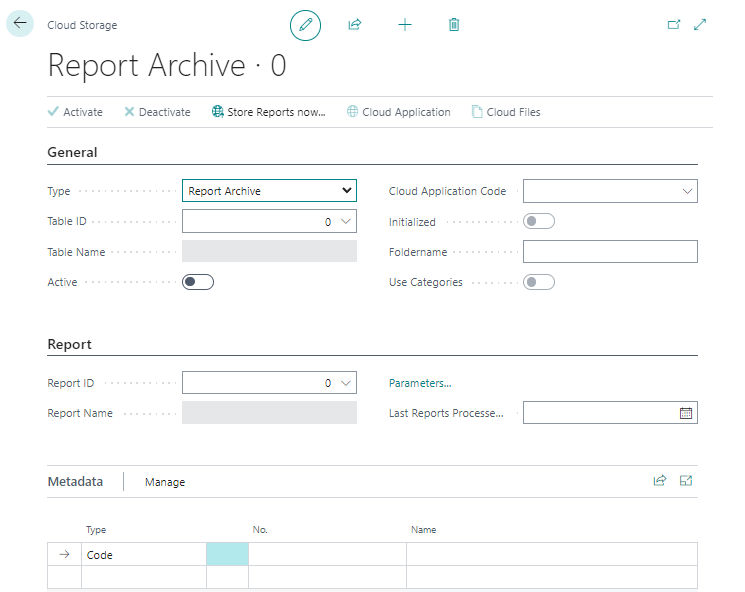
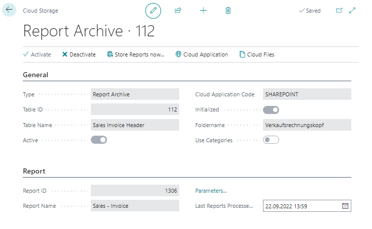

# Set Up Report Archive

This chapter describes how to set up automatic report archiving for your cloud storage. You can set up report archiving so that your documents generated in Business Central (for example, invoices, purchase orders, credit notes, and so on) are automatically uploaded to one of your set-up cloud storages ([Sharepoint](set-up-for-sharepoint.md), [Azure Files](set-up-for-azure-files.md), or [Azure Blob Storage](set-up-for-azure-blob-storage.md)).  

Categories cannot be used in report archiving.  

To set up automatic report archiving, proceed as follows:  

1. Open your Business Central.   
1. From the role center, call the search function (**ALT+Q**) </img>.
1. Search for **[Cloud Storages](https://businesscentral.dynamics.com/?page=70838580)** and click on the appropriate search result.
The **Cloud Storages** page is displayed.  
1. To set up a new drop zone, click **New** in the menu bar.  
1. From the **Type** drop-down list, select **Report Archive**.  
1. The **Cloud storage** tab is extended by the **Report** tab.  
      
1. From the **Table ID** drop-down list, select the table for which you want to add report archiving. Note that report archiving can only be added for tables that are stored in this drop-down list. For example, to set up report archiving for sales invoices, specify ID **112**.  
1. After specifying the table ID (**112**), the **Table name** field will be automatically filled by the system (with the value **Sales Invoice Header**).  
1. In the **Cloud Application Code** field, specify the cloud application you want to use to store the data.  
1. Under the **Report** tab, in the **Report ID** field, specify the report you want to archive automatically.  
1. The **Folder Name** field is automatically completed. By default, this field defaults to the name for the report ID.  
1. Under the **Metadata** tab, you can specify additional information to be stored when uploading files to the cloud storage via report archiving. For example, for a sales invoice, you can save the field information of the **No.**, **Bill-to Customer No.**, **Bill-to Name**, **Your Reference**, and **Posting Date** fields as metadata when archiving for the file. The metadata can be defined as search criteria when searching for files in the cloud (see chapter [Search files](../features/search-files.md)).  
1. Click **Active** in the menu bar to start report archiving. The **Active** slider will be grayed out, indicating that this report archive is set up correctly.  
      

You have set up the report archive. All reports/documents meeting the defined criteria are automatically uploaded to the specified cloud application.  