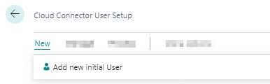
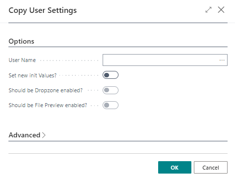

# Set Up Users

This chapter describes how to [add users](#create-new-user) and [copy user permissions](#copy-user-permissions).  

<!-- :::info   -->
**User licenses and license models**  
Note that if you have not purchased an unlimited license for BeyondCloudConnector, you must license all new users. If you need additional licenses or want to switch to a different licensing model, contact us at 
<a href="mailto:info@beyondit.gmbh?cc=sascha.fischer@beyondit.gmbh&amp;subject=Buy new license for BeyondCloudConnector">info@beyondit.gbmh</a>.  
<!-- ::: -->

## Add Users

This section describes how to grant permission to a user to use BeyondCloudConnector.  

To set up a user, proceed as follows:  

1. Open your Business Central.   
1. From the role center, open the search function (**ALT+Q**) 🔍.  
1. Search for **[Cloud Connector User Setup](https://businesscentral.dynamics.com/?page=70838596)** and click the appropriate search result. The **Cloud Connector User Setup** page is displayed.  
1. The list displays all configured users and the assigned permissions.  
1. Click **New** > **Add new initial user** in the menu bar.  
      
1. The **User Search** page is displayed. This list displays all users that are set up in your Business Central.  
1. From the table, select the user you want to add to the list of BeyondCloudConnector users.  
1. Click **OK** to close the window and add the user to the **Cloud Connector User Setup** page.  
1. Scroll down the list to the added user.  
1. The checkboxes in the **Dropzone enabled** and **File preview enabled** columns allow you to set the user's access permissions for displaying dropzones and previewing cloud files, respectively. By default, dropzone access permission is enabled for new users.  

You have added a user to the **Cloud Connector User Setup** list.  

## Copy User Permissions

This section describes how to copy the user permissions of an existing user to a newly added user. This gives the newly added user the same permissions as the existing user.  

Proceed as follows if you want to give a newly added user the same permissions as an existing user:  

1. Open your Business Central.   
1. From the role center, call the search function (**ALT+Q**) 🔍.  
1. Search for **Cloud Connector User Setup** and click the appropriate search result. The **Cloud Connector User Setup** page is displayed.  
1. The list displays all configured users and the assigned permissions.  
1. Select a user from the list and check all permissions you want to transfer for a newly added user.  
1. Click **Process** > **Copy user settings to another user** in the menu bar.  
1. The **Copy User Settings** window is displayed.  
      
1. From the **User Name** dropdown list, select the user. Please note that you will only transfer permissions to the newly added user that were previously selected from the list.  
1. Click **OK** to copy the selected permissions for the newly added user.  

<!-- :::info   -->
**Change all permissions of the user**  
You can change all permissions of the newly added user in the **Copy user settings** window via the **Set new init values?** option. Activate the checkboxes for **Set new init values?**, **Should be Dropzone enabled?** and **Should be File Preview enabled?** to display the Dropzone for all set tables and to enable the File Preview for the user within the Dropzone.  
<!-- ::: -->