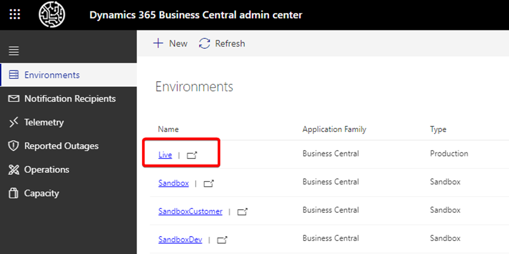
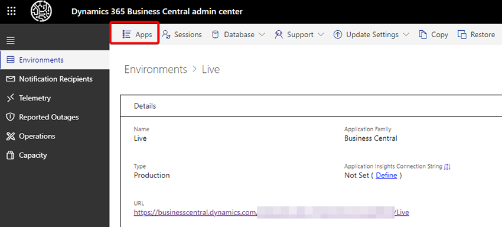
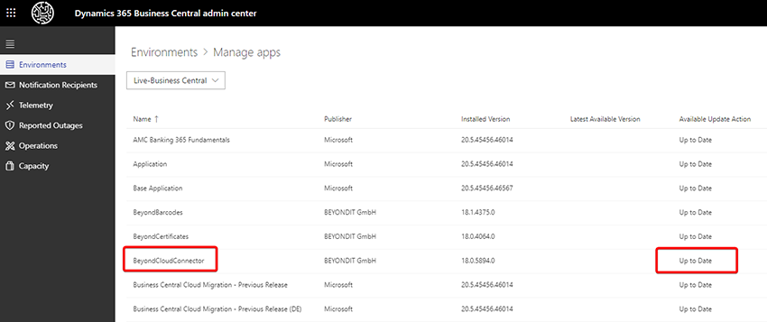

# Update zur neuesten Version des CloudConnectors

In diesem Kapitel wird beschrieben, wie Sie den BeyondCloudConnector manuell auf die neueste Version aktualisieren.  

Der BeyondCloudConnector ist ein lebendiges Produkt, d.h. wir arbeiten fortlaufend an der Weiterentwicklung und Benutzererfahrung. Durch den Austausch mit unseren Kunden untersuchen wir Anwendungsfälle und implementieren die daraus resultierenden Verbesserungen. Die neueste Version wird normalerweise mit dem nächsten Microsoft Update installiert, Sie haben aber auch die Möglichkeit manuell vor dem Update Ihre Apps zu aktualisieren.  

Um die neueste Version des BeyondCloudConnectors für Ihr Business Central manuell zu installieren, gehen Sie wie folgt vor:  

1. Öffnen Sie das Admin Center. Sie erreichen das Admin Center über die nachfolgende URL:
<a role="link" aria-disabled="true">https://businesscentral.dynamics.com/ihre-tenant-id/admin</a>.  
1. Wählen Sie die entsprechende Environment aus, für die Sie das Update durchführen möchten.  
      
1. Klicken Sie in der Menüleiste auf **Apps**.  
      
1. Die Liste zeigt alle installierten Apps für die ausgewählte Umgebung.  
      
1. Navigieren Sie zur App **BeyondCloudConnector** und prüfen Sie den Status.  
1. Sollte ein Update zur Verfügung stehen, können Sie das Update über eine Aktion durchführen.  

Beachten Sie, dass in regelmäßigen Abständen seitens Microsoft ein Update durchgeführt wird. Im Zuge dieses Microsoft-Updates werden auch App-Updates installiert. Es kann daher möglich sein, dass bereits die aktuellste Version des BeyondCloudConnectors installiert ist.  

Wenn Sie Hilfe beim Update benötigen oder diesbezüglich Fragen haben, können Sie uns gern unter 
<a href="mailto:info@beyondit.gmbh?cc=sascha.fischer@beyondit.gmbh&amp;subject=Frage zum Update von BeyondCloudConnector">info@beyondit.gbmh</a> kontaktieren.  