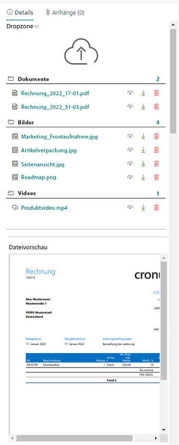
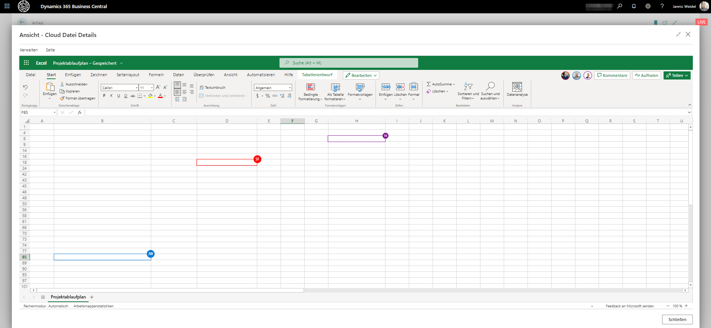

# Dateivorschau anzeigen

BeyondCloudConnector ermöglicht es Ihnen, eine Vorschau von im Cloudspeicher gespeicherten Dateien anzuzeigen.  

>[!NOTE]  
>**Benutzerberechtigungen erforderlich**  
Die Einstellung **Dateivorschau aktiviert** auf der Seite **CloudConnector Benutzereinrichtung** steuert die Vorschau unterhalb der Dropzone für die entsprechenden Tabellen. Verfügt der Benutzer nicht über die Berechtigungen (**Dropzone aktiviert** und **Dateivorschau aktiviert**), wird dem Benutzer weder die Dropzone noch die Dateivorschau angezeigt.  

Gehen Sie wie folgt vor, um die Vorschau einer im Cloudspeicher gespeicherten Datei anzuzeigen:  

1. Klicken Sie in der Dropzone auf den Dateinamen.  
1. Im Infoboxbereich wird eine verkleinerte Vorschau der Datei unter dem Register **Dateivorschau** angezeigt.  
      
1. Wenn Sie eine größere Vorschau der Datei anzeigen möchten, klicken Sie in der Dropzone auf das Augensymbol neben der Datei.  
1. Die Dateiansicht wird geöffnet. In dieser Dateiansicht können Sie die im Cloudspeicher abgelegten Dateien anzeigen – ohne Business Central zu verlassen.  
      

Die Dateivorschau ermöglicht die Handhabung von Dateien innerhalb von Business Central (mit mehreren Personen), das Abspielen von Videodateien und die Bearbeitung von PDF-Dokumenten.  

BeyondCloudConnector bietet eine Vielzahl an Funktionen zur Bearbeitung von Dateien. Alle diese Funktionen können in der Dateivorschau (Augen-Symbol) ausgeführt werden. Nachfolgend finden Sie eine nach Dateityp sortierte Übersicht der Funktionen, die Sie innerhalb der Dateivorschau über Business Central an den in der Cloud gespeicherten Dateien durchführen können:  

<table style="width:100%">
    <tr>
        <th style="width:30%">Dateityp</th>
        <th style="width:70%">Funktion zur Dateihandhabung</th>
    </tr>
    <tr>
        <td><b>PDF-Dateien</b> <i>(.pdf)</i></td>
        <td>
          • Seiten in PDF-Datei drehen 
          • Text hinzufügen 
          • Text hervorheben 
          • Formen zeichnen 
          • Änderungen rückgängig machen 
          • Änderungen speichern 
          • PDF-Datei drucken 
          • PDF-Datei vorlesen 
        </td>
    </tr>
    <tr>
        <td>
            <b>Excel-Dateien</b> 
            <b>Word-Dateien</b> 
            <b>PowerPoint-Dateien</b> 
            <b>OneNote-Dateien</b> 
            <i>(.xlsx, .docx, .pptx, .one)</i> 
        </td>
        <td>
          • Gleichzeitiges Arbeiten mit anderen Mitarbeitern an einer Datei in und außerhalb von Business Central in Echtzeit 
        </td>
    </tr>
    <tr>
        <td>
            <b>Video-Dateien</b> 
            <i>(.mpg, .mpeg, .mp4, .avi, .wmv, .mov, .flv, .webm, …)</i>
        </td>
        <td>
          Wiedergabe mit verschiedenen Optionen: 
          <i>• In Vollbild abspielen</i> 
          <i>• In Bild-in-Bild abspielen</i> 
          <i>• Wiedergabegeschwindigkeit ändern</i> 
          <i>• Lautstärke ändern</i>
        </td>
    </tr>
</table>

>[!NOTE]  
>**PDF-Dateien zusammenführen**  
BeyondCloudConnector bietet Ihnen neben den oben genannten Funktionen in der Vorschau auch die Möglichkeit, mehrere PDF-Dateien zu einer PDF-Datei zusammenzuführen. Weitere Informationen dazu erhalten Sie unter dem Kapitel [PDF-Dateien zusammenführen](merge-pdf-files.md).  