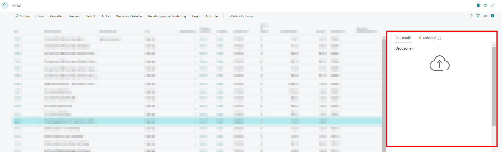
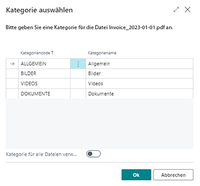

# Dateien hochladen

BeyondCloudConnector ermöglicht es Ihnen, Dateien über die **Dropzone** in Ihren Cloudspeicher hochzuladen. Die Dropzone muss zum Hochladen von Dateien eingerichtet sein. Weitere Informationen dazu erhalten Sie unter dem Kapitel [Dropzone einrichten](../setup/set-up-dropzone.md).  

Für die nachfolgende Beschreibung gehen wir davon aus, dass Sie sich auf einer Seite, Tabelle oder Karte befinden, für die eine Dropzone eingerichtet ist und Sie über die entsprechenden Benutzerberechtigungen zur Anzeige der Dropzone verfügen.  

Um eine Datei in den Cloudspeicher hochzuladen, gehen Sie wie folgt vor:  

1. Blenden Sie den Infoboxbereich in Business Central ein (**ALT+F2**).  
1. Die Dropzone wird im oberen Teil des Infoboxbereichs angezeigt.  
      
1. Klicken Sie auf das Symbol und wählen Sie die Datei aus, die Sie hochladen möchten. Alternativ können Sie auch die Dateien auch per Drag&Drop auf die Dropzone ziehen. Dies ist besonders hilfreich, wenn Sie mehrere Dateien gleichzeitig hochladen möchten.  
1. Wenn Sie Kategorien für die Dropzone eingerichtet haben, werden Sie in einem Fenster aufgefordert, die Datei/en einer Kategorie zuzuordnen. Weitere Informationen zu Kategorien erhalten Sie unter dem Kapitel [Kategorien für Dropzonen einrichten](../setup/set-up-categories-for-dropzone.md).  
      
1. Über den Schieberegler **Kategorie für alle Dateien verwenden** können Sie die ausgewählte Kategorie für alle hochzuladenden Dateien anwenden (wenn Sie mehrere Dateien hochladen).  
1. Klicken Sie auf **OK**, um die Datei hochzuladen.  
      

Im Infoboxbereich unter der Dropzone wird die entsprechende Kategorie mit der von Ihnen hochgeladenen Datei angezeigt. Klicken Sie auf eine Datei, wird die Datei in der Dateivorschau unterhalb der Dropzone im Infoboxbereich angezeigt. Weitere Informationen zur Vorschau von Dateien und den möglichen Funktionen erhalten Sie unter dem Kapitel [Dateivorschau anzeigen](preview-files.md).  