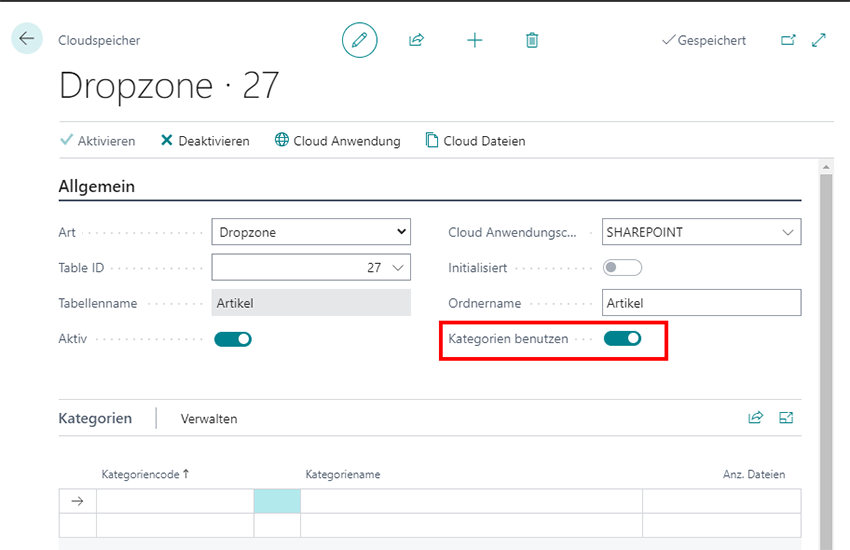
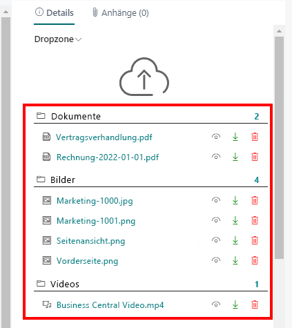
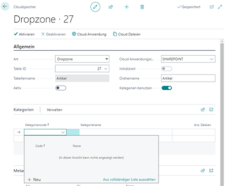
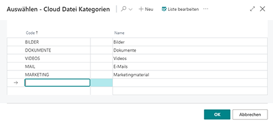
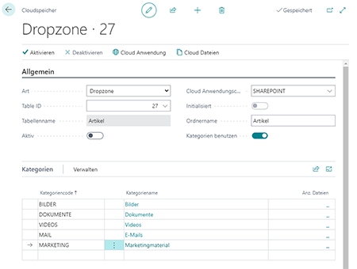

# Kategorien für Dropzonen einrichten

In diesem Abschnitt wird beschrieben, wie Sie Kategorien für eine Dropzone einrichten. Die Kategorien ermöglichen es Ihnen, Dateien strukturiert zu speichern und das Suchen und Finden von Dateien in einem Datensatz zu erleichtern.  

Bei der Einrichtung einer Dropzone für eine Tabelle haben Sie die Möglichkeit die Option **Kategorien benutzen** zu aktivieren.  
      
Ist der Schieberegler aktiviert, wird die Registerkarte **Kategorien** angezeigt. Hier können Sie Kategorien für die Dropzone erstellen.  
      

Um Kategorien für die Dropzone zu erstellen, gehen Sie wie folgt vor:  

1. Öffnen Sie Ihr Business Central.  
1. Rufen Sie aus dem Rollencenter die Suchfunktion auf (**ALT+Q**) 🔍.
1. Suchen Sie nach **[Cloud Speicher](https://businesscentral.dynamics.com/?page=70838580)** und klicken Sie auf das entsprechende Suchergebnis.
Die Seite **Cloud Speicher** wird angezeigt.  
1. Wählen Sie einen Cloudspeicher aus der Liste aus und öffnen Sie die entsprechende Cloudspeicherkarte.  
1. Klicken Sie unter dem Register **Kategorien** in eine leere Zeile unter der Spalte **Kategoriencode**.  
      
1. Wählen Sie aus dem eingeblendeten Menü die Option **Neu** aus.  
1. Das Fenster **Auswählen – Cloud Datei Kategorien** wird angezeigt.  
1. Geben Sie unter der Spalte **Code** einen Code für die Kategorie ein. Sie können beispielsweise den Code **BILDER** verwenden, um eine Kategorie für Bilder zu erstellen.  
1. Geben Sie unter der Spalte **Name** den Namen für die Kategorie ein. Wiederholen Sie den vorangegangen Schritte, wenn Sie weitere Kategorien erstellen möchten.  
1. Klicken Sie auf **OK**, um die neu erstellte/n Kategorie/n zu speichern.  
      
1. Sie werden zu der Cloudspeicherkarte zurückgeleitet.  
1. Geben Sie unter dem Register **Kategorien** die von Ihnen angelegten Kategorien an.  
      

Sie haben eine oder mehrere Kategorien zu dieser Dropzone hinzugefügt. 
Beachten Sie, dass der Cloudspeicher (also die Dropzone) **aktiviert** ist, damit die Kategorien verwendet werden. Beim Hochladen von Dateien werden Sie jetzt danach gefragt, welcher Kategorie die Datei entspricht. Weitere Informationen dazu erhalten Sie unter dem Kapitel [Dateien hochladen](../features/upload-files.md).  
