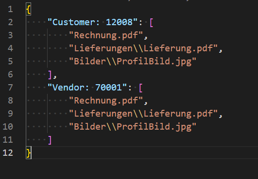

# Azure Files als Cloud-Speicher einrichten

In diesem Kapitel wird beschrieben, wie Sie Ihr Business Central (mithilfe von BEYOND CloudConnector) mit Azure Files verbinden.  
Die Anbindung von Azure Files ermöglicht Ihnen den direkten Zugriff und die Bearbeitung von in der Cloud gespeicherten Dateien, ohne Business Central verlassen zu müssen.  

>[!NOTE]  
>**Berechtigungen in Microsoft Azure erforderlich**  
Für die nachfolgenden Beschreibungen sind Administratorberechtigungen in Microsoft Azure erforderlich. Für die Einrichtung der Verbindung müssen dazu berechtigt sein, Speicherkonten und Container zu erstellen sowie SAS-Token zu erstellen. Wenn Sie Hilfe bei der Einrichtung benötigen oder diesbezüglich Fragen haben, können Sie uns gern unter 
<a href="mailto:info@beyondit.gmbh?cc=sascha.fischer@beyondit.gmbh&amp;subject=Azure Files als Cloud-Speicher einrichten">info@beyondit.gbmh</a> kontaktieren.  

Bitte laden Sie die Datei unter dem nachfolgenden Link herunter:  
<a href="http://docs.beyond365.de/de-DE/cloudconnector/assets/de_DE-CloudConnectorAzureFilesSetup.pdf" download>
  <button>Download</button>
</a>
<a href="http://docs.beyond365.de/de-DE/cloudconnector/assets/de_DE-CloudConnectorAzureFilesSetup.pdf">PDF-Datei herunterladen</a>

Führen Sie die nachfolgenden Schritte durch, um Azure Files in Business Central anzubinden:  

+ [Speicherkonto in Microsoft Azure erstellen](#create-storage-account)  
+ [Shared Access Signatures erstellen](#create-sas)  
+ [CloudConnector mit Azure Files in Business Central anbinden](#connect-cloudconnector-in-business-central)  

**Optional** (falls Sie bereits Dateien in Azure Files gespeichert haben): 
+ [Dateien aus Azure Files importieren](#import-files-from-azure-files)  

## Speicherkonto in Microsoft Azure erstellen

In diesem Abschnitt wird beschrieben, wie Sie ein Speicherkonto in Microsoft Azure erstellen. Das Speicherkonto stellt einen eindeutigen Namespace für Ihre Azure Storage-Daten bereit, auf den von jedem Ort der Welt aus über HTTP oder HTTPS zugegriffen werden kann. Daten in Ihrem Speicherkonto sind dauerhaft und hochverfügbar, sicher und extrem skalierbar.  

1. Öffnen Sie die Webseite [http://www.portal.azure.com/](http://www.portal.azure.com/) und melden Sie sich an.  
1. Klicken Sie in der Menüleiste von Microsoft Azure auf den Menüpunkt **Speicherkonten**.  
      
1. Klicken Sie in der Menüleiste auf **Erstellen**.  
1. Vervollständigen Sie die erforderlichen Informationen zur Erstellung eines neuen Speicherkontos. Wir empfehlen, das Speicherkonto mit dem Namen **beyondcloudconnector** zu versehen. Da die Speicherkontoeinstellungen maßgeblich von den Richtlinien Ihres Unternehmens abhängen, geben wir Ihnen keine Werte vor. Weitere Informationen zu Speicherkontoeinstellungen und wie Sie ein Speicherkonto erstellen, erhalten Sie in der Hilfe zu Microsoft Azure unter dem Kapitel [Speicherkonto erstellen](https://learn.microsoft.com/de-de/azure/storage/common/storage-account-create?tabs=azure-portal).  
1. Klicken Sie für das Speicherkonto unter dem Menüpunkt **Einstellungen** auf **Endpunkte**.  
1. Kopieren Sie den Wert für den **Dateidienst** und tragen Sie diesen in die PDF-Datei unter dem Feld **Konto-URL** ein.  
1. Erstellen Sie eine Dateifreigabe für das Speicherkonto.  
1. Tragen Sie den Namen der erstellten Dateifreigabe in die PDF-Datei unter dem Feld **Freigabename** ein. 

Sie haben ein neues Speicherkonto mit einem Container erstellt. Für die Einrichtung des Cloudspeichers fehlen noch zwei Shared Access Signatures (SAS). Die SAS werden unter dem Abschnitt [Shared Access Signatures erstellen](#create-sas) erstellt.  

## Shared Access Signatures erstellen

In diesem Abschnitt wird beschrieben, wie Sie die beiden Shared Access Signatures (SAS) erstellen zur Einrichtung von Azure Files für BEYOND CloudConnector erstellen.  

1. Öffnen Sie die Webseite [http://www.portal.azure.com/](http://www.portal.azure.com/) und melden Sie sich an.  
1. Klicken Sie in der Menüleiste von Microsoft Azure auf den Menüpunkt **Speicherkonten**.  
1. Wählen Sie das Speicherkonto aus, das Sie im Schritt [Speicherkonto in Microsoft Azure erstellen](#create-storage-account) erstellt haben.  
1. Klicken Sie in der Menüleiste unter dem Bereich **Sicherheit + Netzwerkbetrieb** auf **Shared Access Signature**.  
      
1. Aktivieren Sie unter dem Bereich **Zugelassene Berechtigungen** alle Berechtigungen für die SAS.  
1. Generieren Sie die SAS und tragen Sie diese in das PDF-Dokument unter dem Feld **SAS Token** ein.  
1. Generieren Sie anschließend erneut eine SAS. Bei dieser SAS deaktivieren Sie alle Kontrollkästchen unter dem Bereich **Zugelassene Berechtigungen** mit Ausnahme der Berechtigung **Lesezugriff**.  
1. Kopieren Sie die Zeichenfolge der SAS (Lesezugriff) in die PDF-Datei in das Feld **Lesezugriff SAS-Token**.  

Sie haben die SAS erstellt.  

## CloudConnector mit Azure Files in Business Central anbinden

In diesem Abschnitt wird beschrieben, wie Sie Azure Files über Beyond CloudConnector in Microsoft Business Central anbinden.  

Um Azure Files über die Extension Beyond CloudConnector in Microsoft Dynamics 365 Business Central anzubinden, gehen Sie wie folgt vor:  

1. Öffnen Sie Ihr Business Central und die PDF-Datei mit den gesammelten Daten.  
1. Rufen Sie aus dem Rollencenter die Suchfunktion auf (**ALT+Q**) 🔍.  
1. Suchen Sie nach der Seite **[Cloud Anwendungen](https://businesscentral.dynamics.com/?page=70838580)** und klicken Sie auf das entsprechende Suchergebnis.  
1. Die Seite **Cloud Anwendungen** wird angezeigt.  
1. Um Azure Files an ihr Business Central anzubinden, klicken Sie in der Menüleiste auf **Neu**.  
1. Die Seite **Cloud Anwendung** wird angezeigt.  
      
1. Geben Sie im Feld **Code** den Wert **Azure Files** an.  
1. Im Feld **Anwendungsart** wählen Sie aus dem Dropdownmenü den Wert **Azure Files** aus.  
1. Im Feld **Beschreibung** können Sie eine Beschreibung für die neue Cloud-Anwendung eingeben.  
1. Über den Schieberegler **Dateilöschung erlaubt** steuern Sie, ob in der Cloud gespeicherte Dateien über Business Central gelöscht werden können.  
1. Öffnen Sie die PDF-Datei für die Einrichtung von Azure Files, die Sie in den vorigen Abschnitten mit Informationen gefüllt haben, und übertragen Sie die Werte in die entsprechenden Felder in Business Central.  

Sie haben Azure Files an ihr Business Central angebunden. Wenn Sie bereits Dateien in Azure Files gespeichert haben, können Sie diese mit Hilfe einer JSON-Datei für die Verwendung mit BEYOND CloudConnector importieren. Weitere Informationen dazu erhalten Sie unter dem Abschnitt [Dateien aus Azure Files importieren](#import-files-from-azure-files).  

## Dateien aus Azure Files importieren

In diesem Abschnitt wird beschrieben, wie Sie bereits bestehende Dateien aus Azure Files in Business Central importieren können.  
Diese Funktion wird ausschließlich für Azure Files unterstützt. Beachten Sie, dass für den Import der Dateien noch kein Cloud-Speicher eingerichtet sein darf.  

Um Dateien aus Azure Files in Ihr Business Central zu importieren, gehen Sie wie folgt vor:  

1. Öffnen Sie Ihr Business Central.  
1. Rufen Sie aus dem Rollencenter die Suchfunktion auf (**ALT+Q**) 🔍.  
1. Suchen Sie nach der Seite **[Cloud Datei Importposten](https://businesscentral.dynamics.com/?page=70838585)** und klicken Sie auf das entsprechende Suchergebnis.  
1. Die Seite **Cloud Datei Importposten** wird angezeigt.  
      
1. Klicken Sie in der Menüleiste auf **Cloud Speicher scannen**.  
1. Das Fenster **Bearbeiten – Cloud Dateien scannen…** wird angezeigt.  
      
1. Um die Dateien aus Microsoft Azure zu importieren, müssen Sie eine JSON-Datei (beyondcloudconnector.json) bearbeiten. Laden Sie die Beispieldatei herunter, klicken Sie dazu auf **Beispiel Json herunterladen**.  
1. Öffnen Sie die JSON-Datei in Visual Studio Code. Falls Sie Visual Studio Code nicht installiert haben, erhalten Sie die neueste Version unter diesem Link: [Download Visual Studio Code](https://code.visualstudio.com/Download).  
      
1. Drücken Sie STRG+SHIFT+P, um das Befehlsmenü von Visual Studio Code zu öffnen und geben Sie **Format Document** ein. Bestätigen Sie den Befehl mit der Eingabetaste.  
1. Die JSON-Datei wird formatiert. Vervollständigen Sie die Zuordnungen. An den in der Beispieldatei angegebenen Dateien und Zuordnungen können Sie folgendes ablesen:  
     
    + Die Datei **Rechnung.pdf** befindet sich genau wie die JSON-Datei im Stammverzeichnis in Azure Files. Die Datei **Rechnung.pdf** wird dem Debitor **12008** und dem Kreditor **70001** zugewiesen.  
    + Die Datei **Lieferung.pdf** ist im Verzeichnis **Lieferungen** gespeichert und wird dem Debitor **12008** und dem Kreditor **70001** zugewiesen.  
    + Die Datei **ProfilBild.jpg** ist im Verzeichnis **Bilder** gespeichert und wird dem Debitor **12008** und dem Kreditor **70001** zugewiesen.  
     
Wenn Sie Hilfe beim Import von Dateien aus Azure Files benötigen oder diesbezüglich Fragen haben, können Sie uns gern unter 
<a href="mailto:info@beyondit.gmbh?cc=sascha.fischer@beyondit.gmbh&amp;subject=Hilfe beim Import von Dateien aus Azure Files">info@beyondit.gbmh</a> kontaktieren.  
      
1. Speichern Sie die JSON-Datei unter dem Namen **beyondcloudconnector.json** im Stammverzeichnis des Azure Files-Speichers ab.  
1. Wählen Sie in Business Central unter dem Dropdownmenü **Cloud Anwendungscode** die entsprechende Azure Files-Cloudanwendung aus.  
1. Klicken Sie auf **OK**.  
1. Die Dateien werden aus Azure Files importiert und die entsprechenden Zuordnungen in Business Central hergestellt.  

Sie haben erfolgreich Azure Files an Microsoft Dynamics 365 Business Central angebunden.  
Um die Einrichtung abzuschließen und alle Funktionen zu nutzern, müssen Sie noch die Tabellen definieren, auf denen die Dropzones zur Ablage von Dateien aus Business Central in Azure Files angezeigt werden sollen. Weitere Informationen zur Einrichtung von Dropzones erhalten Sie unter dem Kapitel [Dropzone einrichten](set-up-dropzone.md).  

Sie können auch eine automatische Berichtsarchivierung einrichten. Weitere Informationen dazu finden Sie unter dem Kapitel [Berichtsarchivierung einrichten](set-up-report-archive.md).  

