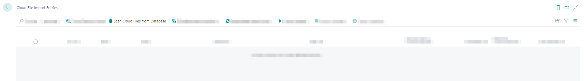
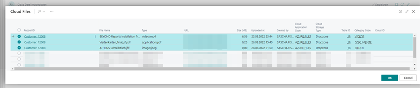
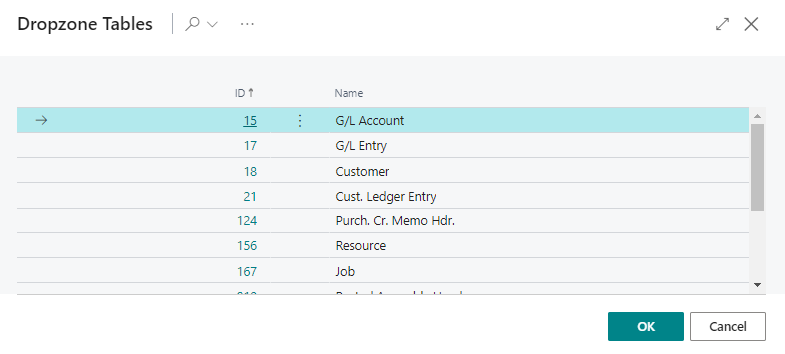

# Copy Files to a Different Record

If you want to move multiple files in dropzones to another record (dropzone), you can upload the files manually or use the cloud file import entries. In this case, you copy the files to the new record, and all the files remain at the copy location.  

<!-- :::info   -->  
**Increased System Load**  
Note that copying files between two records ties up a lot of system resources. The system may become busy if a large number of files are copied, i.e. operation may be impaired. Do not perform this function with large amounts of data and, if possible, outside opening or business hours.  
<!-- ::: -->

To copy files to another record via BeyondCloudConnector, proceed as follows:  

1. Open your Business Central.   
1. From the role center, open the search function (**ALT+Q**) 🔍.  
1. Search for **[Cloud File Import Entries](https://businesscentral.dynamics.com/?page=70838585)** and click on the corresponding search result.  
1. The **Cloud File Import Entries** page is displayed.  
1. From the menu, click **Scan Cloud Files from Database**.  
      
1. The **Edit – Scan Cloud Files…** window is displayed.  
1. In the **New Cloud Application Code** field, specify the application code of the cloud storage to which you want to copy the files.   
1. Click **OK**.  
1. The **Cloud Files** window is displayed. This list shows all files stored in the connected cloud storages.  
1. Select the files which you want to copy to a different record.  
      
1. Click **OK**. The selected files are displayed in the **Cloud File Import Entries** table.  
1. Select the files in the table and click **Select target record** from the menu.  
1. The **Dropzone Tables** window is displayed.  
      
1. Select the drop zone table to which the selected files should be moved.  
1. Click **OK**.  
1. The corresponding table with the records is displayed. Select the corresponding record.  
1. Click **OK** to save the settings for copying the files.  
1. The saved copy settings are displayed on the **Cloud File Import Entries** page.  
1. Select all files to be copied in the list.  
1. Click **Start import** in the menu bar. The files are copied to the record specified under the **Target Record ID** column.  
1. Click **Refresh records** and check if all files have been copied.  

You have copied one or more files into a new record. You can view and edit the file/s in the drop zone associated with the record. For more information on viewing and editing files in the drop zone, see the [Show File Preview](preview-files.md) chapter.  