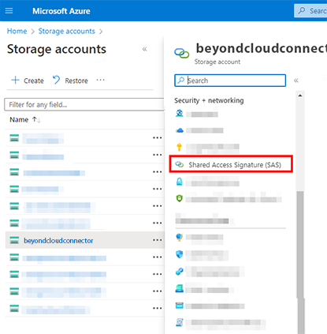
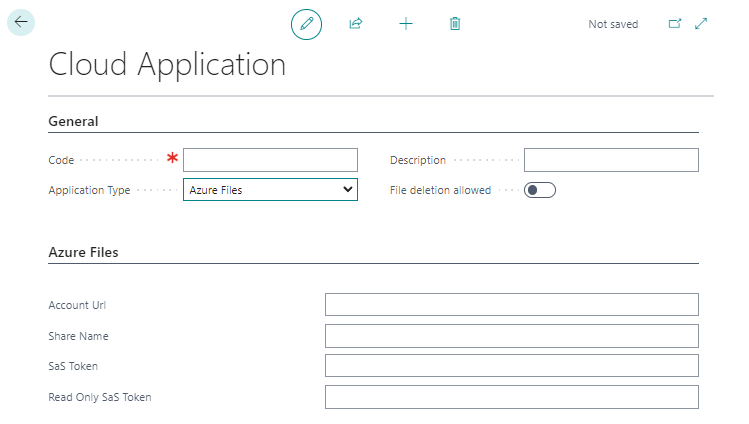
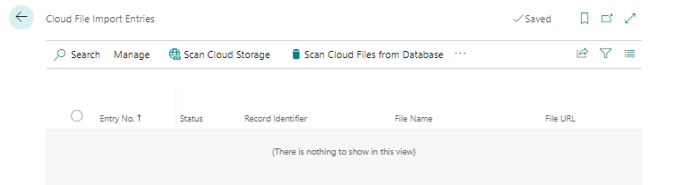
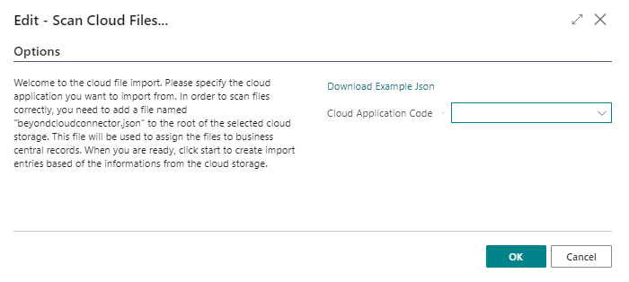
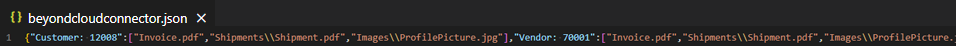
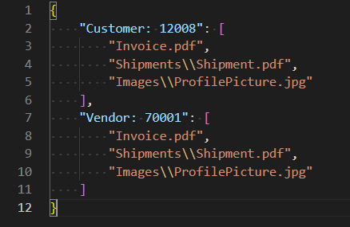

# Set Up Azure Files as Cloud Storage

This chapter describes how to connect your Business Central (using BeyondCloudConnector) to Azure Files.  
Connecting Azure Files allows you to directly access and edit files stored in the cloud without leaving Business Central.  

<!-- :::info   -->  
**Adminstator Privileges required in Microsoft Azure**  
The following descriptions require administrator privileges in Microsoft Azure. To set up the connection, you must have permission to create storage accounts and containers, and to create SAS tokens. If you need help with setup or have any questions in this regard, please feel free to contact us at 
<a href="mailto:info@beyondit.gmbh?cc=sascha.fischer@beyondit.gmbh&amp;subject=Set Up Azure Files as Cloud Storage">info@beyondit.gbmh</a>.  
<!-- ::: -->

Please download the file from the link below:  
<a href="http://docs.beyond365.de/de-DE/cloudconnector/assets/en-US_CloudConnectorAzureFilesSetup.pdf" download>
  <button>Download</button>
</a>
<a href="http://docs.beyond365.de/de-DE/cloudconnector/assets/en-US_CloudConnectorAzureFilesSetup.pdf">Download PDF File</a>

Follow the steps below to connect Azure Files in Business Central:  

+ [Create Storage Account in Microsoft Azure](#create-storage-account)
+ [Generate Shared Access Signatures](#create-sas)
+ [Connect BeyondCloudConnector with Azure Files in Business Central](#connect-cloudconnector-in-business-central)  

**Optional** (if you already have files stored in Azure Files): 
+ [Import Files from Azure Files](#import-files-from-azure-files)  

## Create Storage Account in Microsoft Azure

This section describes how to create a storage account in Microsoft Azure. The storage account provides a unique namespace for your Azure storage data that can be accessed from anywhere in the world using HTTP or HTTPS. Data in your storage account is persistent and highly available, secure, and extremely scalable.   

1. Open the website [http://www.portal.azure.com/](http://www.portal.azure.com/) and log in.  
1. In the Microsoft Azure menu bar, click **Storage Accounts**.  
      
1. Click **Create** in the menu bar.  
1. Complete the required information to create a new storage account. We recommend that you name the storage account **beyondcloudconnector**. Since storage account settings depend largely on your organization's policies, we do not provide any values. For more information about storage account settings and how to create a storage account, see the Microsoft Azure Help chapter [Create a storage account](https://learn.microsoft.com/en-us/azure/storage/common/storage-account-create?tabs=azure-portal).  
1. For the storage account, click **Endpoints** under the **Settings** menu item.  
1. Copy the value for the **File Service** and enter it in the PDF file under the **Account URL** field.  
1. Create a file share for the storage account.  
1. Enter the name of the created file share in the PDF file under the **Share Name** field. 

You have created a new storage account with a container. Two Shared Access Signatures (SAS) are still missing to set up the cloud storage. The SAS are created under the [Generate Shared Access Signatures](#create-sas) section.  

## Generate Shared Access Signatures

This section describes how to create the two Shared Access Signatures (SAS) to set up Azure Files for BEYOND CloudConnector.  

1. Open the website [http://www.portal.azure.com/](http://www.portal.azure.com/) and log in.  
1. In the Microsoft Azure menu bar, click **Storage Accounts**.  
1. Select the storage account that you created in the [Create Storage Account in Microsoft Azure](#create-storage-account) step.  
1. Click **Shared Access Signature** in the menu bar under the **Security + Networking** section.  
      
1. Under the **Allowed Permissions** section, enable all permissions for the SAS.  
1. Generate the SAS and enter it in the PDF document under the **SAS Token** field.  
1. Then generate another SAS. For this SAS, clear all the check boxes under the **Allowed Services** section except for the **Read** permission.  
1. Copy the SAS (read permissions only) string into the PDF file in the **Read only SAS Token** field.  

You have created the SAS.  

## Connect BeyondCloudConnector with Azure Files in Business Central

This section describes how to connect Azure Files via BeyondCloudConnector in Microsoft Business Central.  

To connect Azure Files via the BeyondCloudConnector extension in Microsoft Dynamics 365 Business Central, proceed as follows:  

1. Open your Business Central and the PDF file with the collected data.  
1. From the role center, open the search function (**ALT+Q**) 🔍.  
1. Search for **[Cloud Applications](https://businesscentral.dynamics.com/?page=70838580)** and click on the corresponding search result.  
1. The **Cloud Applications** page is displayed.  
1. To connect Azure Files to your Business Central, click **New** in the menu bar.  
1. The **Cloud Application** page is displayed.  
      
1. In the **Code** field, specify the value **Azure Files**.  
1. In the **Application Type** field, select **Azure Files** from the dropdown menu.  
1. In the **Description** field, you can enter a description for the new cloud application.  
1. Use the **File Deletion Allowed** slider to control whether files stored in the cloud can be deleted via Business Central.  
1. Open the Azure Files setup PDF file that you filled with information in the previous sections and transfer the values to the appropriate fields in Business Central.  

You have connected Azure Files to your Business Central. If you already have files stored in Azure Files, you can import them using a JSON file for use with BeyondCloudConnector. For more information, see the [Import Files from Azure Files](#import-files-from-azure-files) section.  

## Import Files from Azure Files

This section describes how to import existing files from Azure Files into Business Central.  
This feature is supported for Azure Files only. Note that no cloud storage must be set up yet for importing the files.  

To import files from Azure Files into your Business Central, do the following:  

1. Open your Business Central.   
1. From the role center, open the search function (**ALT+Q**) 🔍.  
1. Search for **[Cloud File Import Entries](https://businesscentral.dynamics.com/?page=70838585)** page and click the appropriate search result.  
1. The **Cloud File Import Entries** page is displayed.  
      
1. Click **Scan Cloud Storage** in the menu bar.  
1. The **Edit - Scan Cloud Files...** window is displayed.  
      
1. To import the files from Microsoft Azure, you need to edit a JSON file (beyondcloudconnector.json). Download the sample file by clicking **Download Example Json**.  
1. Open the JSON file in Visual Studio Code. If you don't have Visual Studio Code installed, get the latest version from this link: [Download Visual Studio Code](https://code.visualstudio.com/Download).  
      
1. Press **CTRL+SHIFT+P** to open the command menu of Visual Studio Code and type **Format Document**. Confirm the command with **Enter**.  
1. The JSON file is formatted. Complete the mappings. You can see the following from the files and mappings specified in the sample file:  
    + The **Invoice.pdf** file is located in the root directory in Azure Files just like the JSON file. The **Invoice.pdf** file is assigned to customer **12008** and vendor **70001**.  
    + The file **Shipment.pdf** is stored in the directory **Shipments** and is assigned to customer **12008** and vendor **70001**.  
    + The file **ProfilePicture.jpg** is stored in the directory **Images** and is assigned to the customer **12008** and the vendor **70001**.  
If you need help importing files from Azure Files or have any questions in this regard, please feel free to contact us at 
<a href="mailto:info@beyondit.gmbh?cc=sascha.fischer@beyondit.gmbh&amp;subject=Help with importing files from Azure Files">info@beyondit.gbmh</a>.  
      
1. Save the JSON file under the name **beyondcloudconnector.json** in the root directory of the Azure Files storage.  
1. In Business Central, under the **Cloud Application Code** drop-down menu, select the appropriate Azure Files cloud application.  
1. Click **OK**.  
1. The files are imported from Azure Files and the appropriate mappings are made in Business Central.  

You have successfully connected Azure Files to Microsoft Dynamics 365 Business Central.  
For a complete setup, you still need to define the tables on which you want the dropzones to appear for storing files from Business Central in Azure Files. For more information about setting up Dropzones, see the [Set Up Dropzone](set-up-dropzone.md) chapter.  

You can also set up automatic report archiving. For more information, see the chapter [Set Up Report Archive](set-up-report-archive.md).  